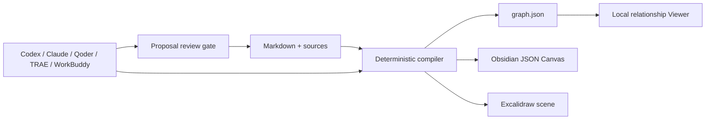

# LLM Wiki Canvas

[English](README.md) · [简体中文](README.zh-CN.md)

[](https://github.com/chicogong/llm-wiki-canvas/actions/workflows/ci.yml)
[](LICENSE)

**A local-first visual compiler for Agent-managed Markdown knowledge bases.**

LLM Wiki Canvas turns Markdown, frontmatter, and WikiLinks into a deterministic relationship graph plus editable Obsidian Canvas and Excalidraw files. Codex, Claude Code, Qoder, TRAE, and Tencent WorkBuddy keep working with ordinary files; people get a visual map, diagnostics, and reviewable generated artifacts.

It does not ship an LLM, vector database, chat UI, cloud service, or MCP server.


## What you get

- **Markdown stays the source of truth.** No proprietary database or forced migration.
- **Relationships become visible.** Search, filter, and inspect the evidence around a page.
- **Wiki quality becomes testable.** Broken links, ambiguous links, missing titles, and orphan pages have exact paths.
- **Selected sources become governed drafts.** Register one Markdown/text source, retain its snapshot and SHA-256, let any Agent edit an isolated draft, then convert it into the existing proposal gate.
- **The Canvas stays yours.** Rebuilds preserve adjusted positions, text/link/group annotations, and manual edges while placing only new pages.
- **Excalidraw stays an open handoff.** Rebuilds retain page positions, hand-drawn annotations, and embedded files while refreshing typed relationships.
- **Large maps become small explanations.** Select one page and one or two relationship layers, then export the same evidence to Mermaid or Excalidraw.
- **Agents use the same repository contract.** The included Skill guides file-first, human-reviewed changes without requiring MCP.
- **Proposals have a visible lifecycle.** Changes shows status, file actions, full hashes, exact diff lines, and safe CLI next steps without applying anything from the UI.
- **Relationship impact is visible before review.** The Change blueprint marks affected pages, added or removed links, and target-hash conflicts before anything is applied.
- **Generated views are reproducible.** Stable node and edge IDs make graph fixtures and Git diffs meaningful.

## Try the working example

The checked-in **Agent Knowledge Atlas** is a small, inspectable wiki about LLM Wiki, visual knowledge, source provenance, and human review.

```bash
git clone https://github.com/chicogong/llm-wiki-canvas.git
cd llm-wiki-canvas
pnpm install
pnpm report:demo
pnpm demo:build
pnpm dev
```

Open <http://127.0.0.1:4173>.

The demo build has a verifiable result:

```text
Built 8 files · 16 links · 0 broken
Graph → public/graph.json
Canvas → examples/atlas-wiki/Atlas.canvas
```

Explore the inputs and outputs:

```text
examples/atlas-wiki/
├── index.md                 # Entry point
├── concepts/                # Structured wiki pages
├── sources/                 # Inspectable source notes
├── Agent Workflow.md        # Agent operating model
├── log.md                   # Maintenance record
├── Atlas.canvas             # Editable generated Canvas
└── Atlas.excalidraw         # Editable generated Excalidraw scene

public/graph.json            # Deterministic Viewer input
```

See [Examples](examples/README.md) for a guided walkthrough and commands you can copy.

See the bilingual [product roadmap](ROADMAP.md) for the Workbench, one-command local serving, proposal review, topology overlays, and optional Excalidraw/Mermaid views.

## How it compares

LLM Wiki Canvas occupies a deliberately small layer. It compiles and checks an existing Markdown wiki; it does not ingest every document format, generate the wiki with an LLM, or answer questions with RAG.

| Tool | Primary job | Choose it when | Relationship to LLM Wiki Canvas |
| --- | --- | --- | --- |
| **LLM Wiki Canvas** | Deterministic graph, lint, and editable Canvas generation | Markdown already exists and Agents need a testable visual contract | This project |
| **Obsidian** | Human Markdown authoring and personal knowledge management | You want the best day-to-day editing experience | Use together: edit the Vault in Obsidian and generate its Canvas with `lwc` |
| **QMD** | Local BM25, vector, and reranked document retrieval | Agents need high-quality local search | Use together: QMD retrieves; `lwc` visualizes and checks structure |
| **LLM Wiki** | LLM-driven ingest into a maintained desktop wiki | You want documents automatically synthesized into wiki pages | Use instead for generation/chat, or run `lwc` over its Markdown when JSON Canvas matters |
| **WeKnora** | Full RAG, Agent, Wiki, ingestion, and team knowledge platform | You need broad formats, retrieval infrastructure, integrations, or RBAC | Use instead when a platform is required; it is not the same lightweight layer |

Read [the complete comparison and decision guide](docs/comparison.md). The feature snapshot was verified against official project documentation on 2026-08-10.

## Benefit comparison

This project does not claim an invented percentage or time saving. The comparison below describes concrete operations you can verify with the example.

| Task | Files alone | With LLM Wiki Canvas |
| --- | --- | --- |
| Understand a new wiki | Open pages and follow links one by one | See the whole relationship graph, then inspect a node and its neighbors |
| Find structural problems | Manually inspect links and filenames | Run `lwc lint`; each diagnostic includes a code and source path |
| Draw an Obsidian Canvas | Create and reconnect nodes manually | Generate it from the wiki while preserving later manual positions |
| Let an Agent contribute | Give broad access and review scattered edits | Stage drafts, review a hash-bound proposal, then explicitly apply it |
| Review generated changes | Compare unstable or opaque output | Diff deterministic JSON with stable node and edge IDs |
| Leave the tool | Export or migrate from a database | Keep the original Markdown and delete generated views at any time |

For the included example, one deterministic build turns **8 source pages and 16 resolved links** into both a searchable graph and an editable Canvas, with **0 broken links**. Those figures come from the compiler, not a benchmark estimate.

Run `pnpm report:demo` to reproduce the full structural snapshot, including connected pages, source metadata, diagnostics, page types, and the most-connected pages. See [Benefits and workflows](docs/value-and-workflows.md) for personal Vault, Agent, and CI usage patterns.

## Use it on your own vault

During development:

```bash
pnpm build
pnpm lwc serve /path/to/vault
pnpm lwc report /path/to/vault
pnpm lwc build /path/to/vault \
  --graph public/graph.json \
  --canvas /path/to/vault/Wiki.canvas \
  --excalidraw /path/to/vault/Wiki.excalidraw
```

After `pnpm build`, the package exposes both `llm-wiki-canvas` and `lwc`:

```bash
lwc serve /path/to/vault
lwc scan /path/to/vault -o .lwc/graph.json
lwc lint /path/to/vault
lwc report /path/to/vault
lwc intake create /path/to/vault --source /path/to/meeting.txt --target concepts/Meeting.md --generator Codex
lwc canvas /path/to/vault -o /path/to/vault/Wiki.canvas
lwc excalidraw /path/to/vault -o /path/to/vault/Wiki.excalidraw
lwc diagram /path/to/vault --focus "Human Review" --depth 1 --format mermaid -o Human-Review.mmd
lwc build /path/to/vault \
  --graph .lwc/graph.json \
  --canvas /path/to/vault/Wiki.canvas \
  --excalidraw /path/to/vault/Wiki.excalidraw
```

`lwc serve` opens the complete Map, Health, and Changes Workbench at <http://127.0.0.1:4173>. It refreshes after Markdown or proposal changes, binds to loopback by default, keeps the last valid graph if a rebuild fails, and does not write generated state into the Vault. Use `--port <number>` to change the port or `--no-watch` for a fixed snapshot.

For reproducible checked-in fixtures, pass `--generated-at <ISO timestamp>` to `lwc build`. It fixes graph generation and node modification timestamps for that output.

For Obsidian, QMD, Agent Skill, and CI workflows, see the [usage guide](docs/usage.md).

For source intake, edit only the draft path printed by `lwc intake create`, inspect it with `lwc intake show <manifest>`, then run `lwc intake propose <manifest> /path/to/vault`. The CLI rechecks the original source, copied snapshot, declared target, and draft state before creating a proposal. It does not call a model or change formal Markdown. See [Governed source intake](docs/intake.md).

## Use it with AI coding agents

The repository now includes one shared Agent contract plus native entry points where each tool expects them:

| Agent | Ready-to-use repository files |
| --- | --- |
| Codex | `AGENTS.md` + `.agents/skills/llm-wiki-canvas/` |
| TRAE | `AGENTS.md` + the same `.agents/skills/` Skill |
| Qoder | `AGENTS.md` + `.qoder/skills/llm-wiki-canvas/` adapter |
| Claude Code | `CLAUDE.md` + `.claude/skills/llm-wiki-canvas/` adapter |
| Tencent WorkBuddy | Select the repository as workspace and `@`-reference `AGENTS.md` and the shared Skill |

See [Using AI agents](docs/ai-agents.md) for exact setup, compatibility limits, permissions, and copy-ready tasks. Local file access plus `lwc` is sufficient; no MCP server is required for this workflow.

## Review Agent knowledge changes

Formal Markdown changes can now stay outside the Vault until a person accepts their exact content:

```bash
lwc proposal create /path/to/vault --from /path/to/draft --summary "Add reviewed notes"
lwc proposal show /path/to/proposal.json
lwc proposal review /path/to/proposal.json --approve <proposal-id> --reviewer "Alice"
lwc proposal apply /path/to/proposal.json /path/to/vault --confirm <proposal-id>
```

Apply verifies the reviewed payload, review record, target paths, and original SHA-256 hashes before writing. A concurrent source edit or any post-review proposal change blocks the apply. See [Reviewed knowledge changes](docs/proposals.md) for rejection, security boundaries, and the runnable example.

## Supported knowledge conventions

- Markdown files and headings
- YAML frontmatter: `title`, `type`/`kind`, `tags`, `summary`, and `source`
- WikiLinks: `[[Page]]`, aliases, headings, paths, and embeds
- Markdown links to `.md` files
- Page kinds: `index`, `concept`, `source`, and `note`
- Obsidian-compatible JSON Canvas
- Repository instructions such as `AGENTS.md`, `CLAUDE.md`, `.agents/`, `.claude/`, and `.qoder/` are excluded from the knowledge graph

## Architecture



Markdown is durable knowledge. The graph, Canvas, and Viewer data are disposable projections that can be rebuilt.

## Current capabilities

- Parse Markdown, YAML frontmatter, WikiLinks, embeds, and `.md` links.
- Generate stable node and edge IDs.
- Report broken and ambiguous links, missing titles, and orphan pages.
- Produce Markdown or JSON health reports from observed structure without inventing a score.
- Create one source-bound Markdown/text intake with a copied snapshot, SHA-256 provenance, generator record, isolated target, and drift/tamper checks.
- Stage, diff, review, reject, and hash-check Markdown proposals before applying Agent changes.
- Generate an Obsidian-compatible `.canvas` file.
- Generate an editable `.excalidraw` scene with stable IDs and typed relationship styles.
- Export a focused one- or two-layer neighborhood to Mermaid or Excalidraw with direction and page-kind filters.
- Preserve manual Canvas positions on regeneration.
- Browse, search, filter, and inspect relationships in the local Viewer.
- Guide repository-scoped Agents through the included `llm-wiki-canvas` Skill.

## Verification

Run the complete release-style verification:

```bash
pnpm verify
```

It performs secret scanning, dependency auditing, unit tests, a reproducible demo build, TypeScript and production builds, Skill validation, a packed npm install smoke test, and production Viewer tests on desktop and mobile.

## Direction

Governed single-source text intake is now shipped in the CLI. The next increment is a read-only Drafts view that exposes intake evidence and validation state in the Workbench before proposal conversion.

See [Contributing](CONTRIBUTING.md), [Security](SECURITY.md), and the [Changelog](CHANGELOG.md).

Apache-2.0
