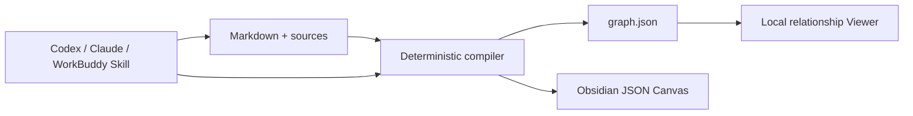

# LLM Wiki Canvas

[](https://github.com/chicogong/llm-wiki-canvas/actions/workflows/ci.yml)
[](LICENSE)

LLM Wiki Canvas is a local-first visual knowledge workspace for Codex, Claude Code, WorkBuddy, and Obsidian. It compiles Markdown and WikiLinks into a deterministic relationship graph and an editable JSON Canvas. It does not ship an LLM, vector database, chat UI, or MCP server.

## Why this exists

The LLM Wiki idea is strongest when the wiki behaves like a codebase: raw sources remain inspectable, agents make focused changes under repository instructions, and generated indexes can be linted and rebuilt. LLM Wiki Canvas adds a visual relationship layer without replacing Markdown as truth.

## v0.1 capabilities

- Parse Markdown, YAML frontmatter, WikiLinks, embeds, and `.md` links.
- Generate stable node and edge IDs in `graph.json`.
- Report broken and ambiguous links plus orphan counts.
- Report exact orphan and missing-title paths; ignore `AGENTS.md`, `CLAUDE.md`, and `.agents/` schema files.
- Generate an Obsidian-compatible `.canvas` file.
- Preserve manual Canvas positions on regeneration.
- Browse, search, filter, and inspect relationships in the local Viewer.
- Guide Codex-compatible agents through the repo-scoped `llm-wiki-canvas` Skill.

## Quick start

```bash
pnpm install
pnpm demo:build
pnpm dev
```

Open `http://127.0.0.1:4173`.

Build your own vault:

```bash
pnpm exec tsx src/cli/index.ts build /path/to/vault \
  --graph public/graph.json \
  --canvas /path/to/vault/Wiki.canvas
```

Run the complete release-style verification, including a packed npm install and production Viewer tests:

```bash
pnpm verify
```

After `pnpm build`, the package also exposes `llm-wiki-canvas` and `lwc`:

```bash
lwc lint /path/to/vault
lwc canvas /path/to/vault -o /path/to/vault/Wiki.canvas
```

## Architecture



Source content remains human-readable and Git-friendly. Generated views can be deleted and rebuilt.

## Project status

This is a working v0.1 prototype. Mermaid-to-Excalidraw and Markmap exporters are planned after the graph contract stabilizes.

Apache-2.0
