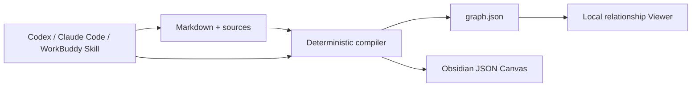

# LLM Wiki Canvas

[English](README.md) · [简体中文](README.zh-CN.md)

[](https://github.com/chicogong/llm-wiki-canvas/actions/workflows/ci.yml)
[](LICENSE)

**A local-first visual compiler for Agent-managed Markdown knowledge bases.**

LLM Wiki Canvas turns Markdown, frontmatter, and WikiLinks into a deterministic relationship graph and an editable Obsidian JSON Canvas. Codex, Claude Code, and WorkBuddy keep working with ordinary files; people get a visual map, diagnostics, and reviewable generated artifacts.

It does not ship an LLM, vector database, chat UI, cloud service, or MCP server.


## What you get

- **Markdown stays the source of truth.** No proprietary database or forced migration.
- **Relationships become visible.** Search, filter, and inspect the evidence around a page.
- **Wiki quality becomes testable.** Broken links, ambiguous links, missing titles, and orphan pages have exact paths.
- **The Canvas stays editable.** Rebuilds preserve manually adjusted node positions.
- **Agents use the same repository contract.** The included Skill guides file-first, human-reviewed changes without requiring MCP.
- **Generated views are reproducible.** Stable node and edge IDs make graph fixtures and Git diffs meaningful.

## Try the working example

The checked-in **Agent Knowledge Atlas** is a small, inspectable wiki about LLM Wiki, visual knowledge, source provenance, and human review.

```bash
git clone https://github.com/chicogong/llm-wiki-canvas.git
cd llm-wiki-canvas
pnpm install
pnpm demo:build
pnpm dev
```

Open <http://127.0.0.1:4173>.

The demo build has a verifiable result:

```text
Built 8 files · 16 links · 0 broken
Graph → public/graph.json
Canvas → examples/atlas-wiki/Atlas.canvas
```

Explore the inputs and outputs:

```text
examples/atlas-wiki/
├── index.md                 # Entry point
├── concepts/                # Structured wiki pages
├── sources/                 # Inspectable source notes
├── Agent Workflow.md        # Agent operating model
├── log.md                   # Maintenance record
└── Atlas.canvas             # Editable generated Canvas

public/graph.json            # Deterministic Viewer input
```

See [Examples](examples/README.md) for a guided walkthrough and commands you can copy.

## Benefit comparison

This project does not claim an invented percentage or time saving. The comparison below describes concrete operations you can verify with the example.

| Task | Files alone | With LLM Wiki Canvas |
| --- | --- | --- |
| Understand a new wiki | Open pages and follow links one by one | See the whole relationship graph, then inspect a node and its neighbors |
| Find structural problems | Manually inspect links and filenames | Run `lwc lint`; each diagnostic includes a code and source path |
| Draw an Obsidian Canvas | Create and reconnect nodes manually | Generate it from the wiki while preserving later manual positions |
| Let an Agent contribute | Give broad access and review scattered edits | Keep repo instructions and the Agent Skill next to the Markdown |
| Review generated changes | Compare unstable or opaque output | Diff deterministic JSON with stable node and edge IDs |
| Leave the tool | Export or migrate from a database | Keep the original Markdown and delete generated views at any time |

For the included example, one deterministic build turns **8 source pages and 16 resolved links** into both a searchable graph and an editable Canvas, with **0 broken links**. Those figures come from the compiler, not a benchmark estimate.

## Use it on your own vault

During development:

```bash
pnpm exec tsx src/cli/index.ts build /path/to/vault \
  --graph public/graph.json \
  --canvas /path/to/vault/Wiki.canvas
```

After `pnpm build`, the package exposes both `llm-wiki-canvas` and `lwc`:

```bash
lwc scan /path/to/vault -o .lwc/graph.json
lwc lint /path/to/vault
lwc canvas /path/to/vault -o /path/to/vault/Wiki.canvas
lwc build /path/to/vault \
  --graph .lwc/graph.json \
  --canvas /path/to/vault/Wiki.canvas
```

For reproducible checked-in fixtures, pass `--generated-at <ISO timestamp>` to `lwc build`. It fixes graph generation and node modification timestamps for that output.

## Supported knowledge conventions

- Markdown files and headings
- YAML frontmatter: `title`, `type`/`kind`, `tags`, `summary`, and `source`
- WikiLinks: `[[Page]]`, aliases, headings, paths, and embeds
- Markdown links to `.md` files
- Page kinds: `index`, `concept`, `source`, and `note`
- Obsidian-compatible JSON Canvas
- Repository instructions such as `AGENTS.md`, `CLAUDE.md`, and `.agents/` are excluded from the knowledge graph

## Architecture



Markdown is durable knowledge. The graph, Canvas, and Viewer data are disposable projections that can be rebuilt.

## Current capabilities

- Parse Markdown, YAML frontmatter, WikiLinks, embeds, and `.md` links.
- Generate stable node and edge IDs.
- Report broken and ambiguous links, missing titles, and orphan pages.
- Generate an Obsidian-compatible `.canvas` file.
- Preserve manual Canvas positions on regeneration.
- Browse, search, filter, and inspect relationships in the local Viewer.
- Guide repository-scoped Agents through the included `llm-wiki-canvas` Skill.

## Verification

Run the complete release-style verification:

```bash
pnpm verify
```

It performs secret scanning, dependency auditing, unit tests, a reproducible demo build, TypeScript and production builds, Skill validation, a packed npm install smoke test, and production Viewer tests on desktop and mobile.

## Direction

The next product layer is a multi-format visual compiler: a shared visual intermediate representation with JSON Canvas, Excalidraw, Markmap, and Mermaid projections. Agent changes will follow a `propose → diff → review → apply` workflow rather than silently editing the wiki.

See [Contributing](CONTRIBUTING.md), [Security](SECURITY.md), and the [Changelog](CHANGELOG.md).

Apache-2.0
