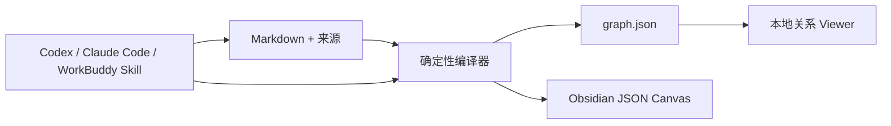

# LLM Wiki Canvas

[English](README.md) · [简体中文](README.zh-CN.md)

[](https://github.com/chicogong/llm-wiki-canvas/actions/workflows/ci.yml)
[](LICENSE)

**面向 Agent 管理的 Markdown 知识库的本地优先可视化编译器。**

LLM Wiki Canvas 把 Markdown、YAML frontmatter 和 WikiLink 编译成确定性的关系图和可继续编辑的 Obsidian JSON Canvas。Codex、Claude Code、WorkBuddy 仍然操作普通文件；人可以查看全局关系、定位知识库问题并审查生成产物。

项目不内置 LLM、向量数据库、聊天界面、云服务或 MCP Server。


## 你能得到什么

- **Markdown 始终是事实源。** 不引入专有数据库，也不强制迁移已有 Vault。
- **关系可以直接看见。** 搜索、筛选页面，并查看一个页面周围的证据与相邻关系。
- **知识库质量可以测试。** 断链、歧义链接、缺少标题和孤立页面都有准确路径。
- **Canvas 仍然可编辑。** 重新生成时保留用户手工调整过的节点位置。
- **Agent 遵循同一套仓库契约。** 内置 Skill 指导 Agent 以文件为中心、经人工审查地工作，不依赖 MCP。
- **生成视图可复现。** 稳定的节点和边 ID，让图谱 fixture 与 Git diff 有实际意义。

## 运行真实示例

仓库自带 **Agent Knowledge Atlas**：一个规模不大、可以逐页检查的知识库，内容涉及 LLM Wiki、可视化知识、来源追溯和人工审查。

```bash
git clone https://github.com/chicogong/llm-wiki-canvas.git
cd llm-wiki-canvas
pnpm install
pnpm demo:build
pnpm dev
```

浏览器打开 <http://127.0.0.1:4173>。

示例构建结果可以直接验证：

```text
Built 8 files · 16 links · 0 broken
Graph → public/graph.json
Canvas → examples/atlas-wiki/Atlas.canvas
```

示例的输入和输出：

```text
examples/atlas-wiki/
├── index.md                 # 知识库入口
├── concepts/                # 结构化概念页面
├── sources/                 # 可检查的来源笔记
├── Agent Workflow.md        # Agent 工作方式
├── log.md                   # 维护记录
└── Atlas.canvas             # 可编辑的生成 Canvas

public/graph.json            # 确定性的 Viewer 输入
```

更完整的操作步骤见 [Examples](examples/README.md)。

## 收益对比

这里不编造“提升百分比”或“节省多少小时”。下表只比较能在示例中真实验证的操作差异。

| 任务 | 只有 Markdown 文件 | 使用 LLM Wiki Canvas |
| --- | --- | --- |
| 理解陌生知识库 | 逐页打开并沿链接跳转 | 先看完整关系图，再检查节点及其邻居 |
| 发现结构问题 | 人工检查链接和文件名 | 执行 `lwc lint`，每条诊断都有错误码和源文件路径 |
| 制作 Obsidian Canvas | 手工创建、连接和维护节点 | 从 Wiki 生成，并保留后续手工调整的位置 |
| 让 Agent 参与维护 | 开放较大修改范围，再分散审查 | 把仓库规则和 Agent Skill 与 Markdown 放在一起 |
| 审查生成变化 | 比较不稳定或不透明的输出 | 对稳定节点、关系 ID 生成的 JSON 做 Git diff |
| 随时退出工具 | 从数据库导出或迁移 | 原始 Markdown 不受影响，生成视图可随时删除重建 |

对仓库自带示例而言，一次确定性构建会把 **8 个源页面、16 条有效关系**同时生成可搜索图谱和可编辑 Canvas，并确认 **0 条断链**。这些数字来自编译器实际输出，不是估算基准。

## 用在自己的 Vault

开发环境可以直接执行：

```bash
pnpm exec tsx src/cli/index.ts build /path/to/vault \
  --graph public/graph.json \
  --canvas /path/to/vault/Wiki.canvas
```

执行 `pnpm build` 后，包会暴露 `llm-wiki-canvas` 和 `lwc` 两个命令：

```bash
lwc scan /path/to/vault -o .lwc/graph.json
lwc lint /path/to/vault
lwc canvas /path/to/vault -o /path/to/vault/Wiki.canvas
lwc build /path/to/vault \
  --graph .lwc/graph.json \
  --canvas /path/to/vault/Wiki.canvas
```

如果要把生成结果提交到 Git，请给 `lwc build` 传入 `--generated-at <ISO 时间>`，固定该次输出中的生成时间和节点修改时间。

## 支持的知识库约定

- Markdown 文件和标题
- YAML frontmatter：`title`、`type`/`kind`、`tags`、`summary`、`source`
- WikiLink：普通链接、别名、标题锚点、相对路径和嵌入
- 指向 `.md` 文件的 Markdown 链接
- 页面类型：`index`、`concept`、`source`、`note`
- Obsidian 兼容 JSON Canvas
- `AGENTS.md`、`CLAUDE.md`、`.agents/` 等仓库规则不会混入知识图谱

## 架构



Markdown 是长期保存的知识；关系图、Canvas 和 Viewer 数据都是可以随时重建的投影。

## 当前能力

- 解析 Markdown、YAML frontmatter、WikiLink、嵌入与 `.md` 链接。
- 生成稳定的节点和关系 ID。
- 报告断链、歧义链接、缺少标题和孤立页面。
- 生成 Obsidian 兼容 `.canvas` 文件。
- 重新生成时保留 Canvas 手工位置。
- 在本地 Viewer 中浏览、搜索、筛选并检查关系。
- 通过内置 `llm-wiki-canvas` Skill 指导仓库级 Agent。

## 完整验证

执行发布级验证：

```bash
pnpm verify
```

它包括敏感信息扫描、依赖审计、单元测试、可复现示例构建、TypeScript 与生产构建、Skill 校验、真实 npm 打包安装冒烟测试，以及桌面端和移动端的生产 Viewer 测试。

## 后续方向

下一层会是多格式 Visual Compiler：建立统一视觉中间层，并生成 JSON Canvas、Excalidraw、Markmap 和 Mermaid。Agent 修改采用 `propose → diff → review → apply`，而不是静默改写知识库。

另见 [贡献指南](CONTRIBUTING.md)、[安全策略](SECURITY.md)和[变更记录](CHANGELOG.md)。

Apache-2.0
