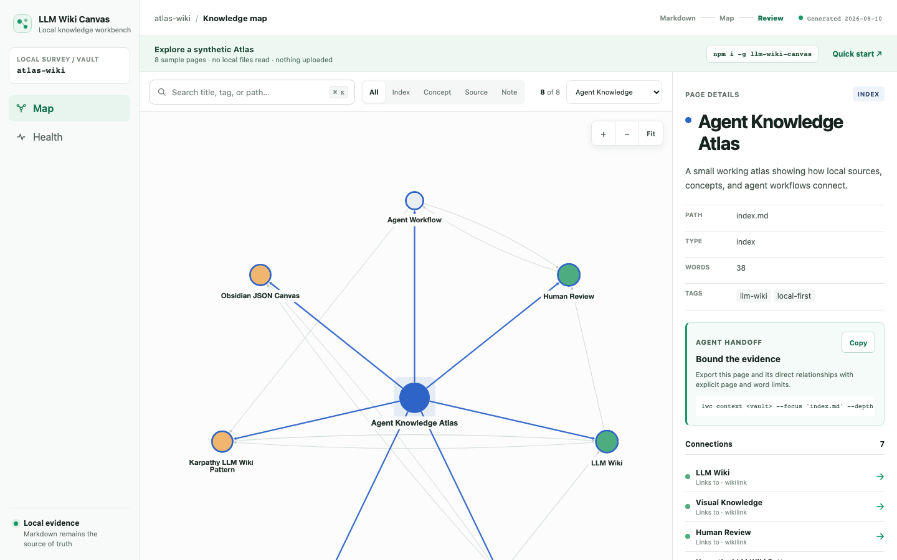
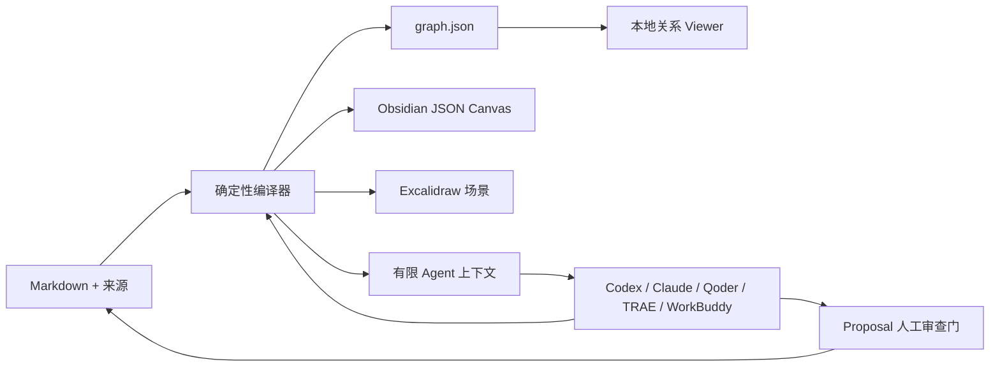

# LLM Wiki Canvas

[English](README.md) · [简体中文](README.zh-CN.md)

[](https://github.com/chicogong/llm-wiki-canvas/actions/workflows/ci.yml)
[](https://www.npmjs.com/package/llm-wiki-canvas)
[](LICENSE)

**面向 AI Agent 的 Markdown 知识变更审查层。**

Agent 可以写，知识不能悄悄失控。

LLM Wiki Canvas 让 Codex、Claude Code、DeepSeek Harness、Qoder、TRAE 和腾讯 WorkBuddy 在明确边界内理解本地 Markdown 并提出修改。每份选定资料都有来源快照，每份生成内容先留在隔离草稿，每个 Proposal 都带精确 diff、来源与目标哈希以及关系影响，最后仍由人决定是否进入正式知识库。

Markdown 始终是事实源。LWC 不上传 Vault，也不内置 LLM、向量数据库、聊天界面、云服务或强制 MCP Server。

[体验中文热点雷达](https://realtime-ai.chat/llm-wiki-canvas/?lang=zh-CN) · [从 npm 安装](#快速开始) · [阅读使用指南](docs/usage.zh-CN.md)



## 它解决什么问题

代码修改已经有分支、diff、CI、Review 和合并保护；Agent 修改知识通常还没有。一段看起来正确的 Markdown，背后可能使用了过期资料、读取范围过大、覆盖了并发修改，或者根本无法追溯结论来源。

LWC 给现有文件补上缺失的知识变更控制流程：

```text
选定来源 → 哈希绑定的隔离草稿 → 可审查 Proposal → 人工决定 → 正式 Markdown
```

## 核心闭环

- **只给 Agent 有边界的证据。** 导出明确页面邻域，限制页面数和字数，保留相对路径、完整文件哈希、截断和遗漏。
- **生成内容不直接进入正式知识。** 捕获一份明确来源及其 SHA-256，Agent 只能编辑声明过的隔离草稿。
- **审查实际变化，而不是相信承诺。** 批准前检查精确 diff、来源和目标哈希、目标范围、关系影响与冲突。
- **证据漂移时自动拒绝。** 来源、草稿、Proposal 或目标文件任一变化，原有交接立即失效，不静默写入。
- **一套规则服务多个 Agent。** 同一文件契约和 CLI 可跨宿主复用；可选 DeepSeek Harness Bundle 只开放最小知识管理面。

## 支撑能力

- **Markdown 始终是事实源。** 不引入专有数据库，也不强制迁移已有 Vault。
- **关系可以直接看见。** 搜索、筛选页面，并查看一个页面周围的证据与相邻关系。
- **知识库质量可以测试。** 断链、歧义链接、缺少标题和孤立页面都有准确路径。
- **OKF 信任信号可以检查。** Open Knowledge Format v0.2 的来源、验证、时效、生命周期、资料与 Attested Computation 契约会进入图谱和有限上下文，但不会变成不透明评分或可执行载荷。
- **Canvas 的所有权仍属于你。** 重建时保留节点位置、文字/链接/分组批注和手工连线，只安置新增页面。
- **Excalidraw 仍是开放交接文件。** 重建时保留页面位置、手绘批注和嵌入文件，同时刷新分类关系。
- **把大图变成小型解释图。** 选择一个页面及一至两层关系，把同一份证据导出到 Mermaid 或 Excalidraw。
- **Agent 遵循同一套仓库契约。** 内置 Skill 指导 Agent 以文件为中心、经人工审查地工作，不依赖 MCP。
- **Agent 支持情况可以测试。** `lwc agents . --strict` 会校验 Codex、Claude Code、Qoder、TRAE、WorkBuddy 的实际入口文件，并生成可由 CI 复现的兼容矩阵。
- **Agent 初始化不会覆盖文件。** `lwc init <workspace>` 先预览全部入口；只有加 `--write` 才创建缺失文件，发现已有文件过期或不安全时整次拒绝写入。
- **Proposal 生命周期可以直接检查。** Changes 展示状态、文件动作、完整哈希、精确 diff 和安全 CLI 下一步，但 UI 本身不执行 apply。
- **审核前即可看到关系影响。** Change blueprint 会标出受影响页面、新增或删除的链接，以及目标哈希冲突，且不会写入正式知识。
- **生成视图可复现。** 稳定的节点和边 ID，让图谱 fixture 与 Git diff 有实际意义。

## 快速开始

需要 Node.js 22 或 24。安装公开包；不要安装 Salesforce 的同名 `lwc` npm 包。

```bash
npm install --global llm-wiki-canvas
lwc serve /path/to/vault
```

然后打开 <http://127.0.0.1:4173>。服务默认只监听 loopback，读取普通 Markdown，不会上传 Vault。

如需从源码运行仓库内的合成示例：

仓库自带 **Agent Knowledge Atlas**：一个规模不大、可以逐页检查的合成知识库，内容涉及 LLM Wiki、可视化知识、来源追溯和人工审查。它是产品测试夹具，不是真实用户 Vault 的使用证据。

```bash
git clone https://github.com/chicogong/llm-wiki-canvas.git
cd llm-wiki-canvas
pnpm install
pnpm report:demo
pnpm demo:build
pnpm dev
```

浏览器打开 <http://127.0.0.1:4173>。

中文页面使用另一份可复现的模拟知识库，内容是 2026-08-14 核对的 Agent Harness、Agent Skills、MCP 与 DeepSeek Harness 公开快照。它用于演示中文搜索和证据关系，不代表实时新闻服务，也不代表生产集成已经完成。

```bash
pnpm demo:build:zh
pnpm dev
```

浏览器打开 <http://127.0.0.1:4173/?lang=zh-CN>；右上角可以随时切回英文 Atlas。

静态 Viewer 只读取仓库内置的模拟关系图、草稿和 Proposal，让访客在不接触本地数据的情况下体验审查流程。真实 Drafts 和 Changes 需要本机回环地址上的 `lwc serve`；两种模式都不会上传 Vault。

示例构建结果可以直接验证：

```text
Built 8 files · 16 links · 0 broken
Graph → public/graph.json
Canvas → examples/atlas-wiki/Atlas.canvas
```

示例的输入和输出：

```text
examples/atlas-wiki/
├── index.md                 # 知识库入口
├── concepts/                # 结构化概念页面
├── sources/                 # 可检查的来源笔记
├── Agent Workflow.md        # Agent 工作方式
├── log.md                   # 维护记录
├── Atlas.canvas             # 可编辑的生成 Canvas
└── Atlas.excalidraw         # 可编辑的 Excalidraw 场景

public/graph.json            # 确定性的 Viewer 输入
public/agent-trends-zh.json  # 中文热点雷达的确定性 Viewer 输入
```

更完整的操作步骤见 [Examples](examples/README.md)。

当前产品边界和下一步验证计划见[双语产品路线图](ROADMAP.md)。

## 与其他工具怎么选

LLM Wiki Canvas 有意只做很小的一层：为已有 Markdown Wiki 提供受控读取和可审查写回。它不与其他产品争夺多格式导入、语义检索、聊天或自动生成整个 Wiki。

| 工具 | 核心职责 | 适合选择它的情况 | 与 LLM Wiki Canvas 的关系 |
| --- | --- | --- | --- |
| **LLM Wiki Canvas** | 哈希绑定的 Agent 上下文、草稿、Proposal 与人工写回 | 已经有 Markdown，需要追溯和审查 Agent 修改 | 本项目 |
| **Obsidian** | 人工编辑 Markdown 与个人知识管理 | 需要优秀的日常写作和浏览体验 | 组合使用：Obsidian 编辑 Vault，`lwc` 生成 Canvas |
| **QMD** | 本地 BM25、向量与重排检索 | Agent 需要高质量本地搜索 | 组合使用：QMD 检索，`lwc` 可视化并检查结构 |
| **LLM Wiki** | LLM 自动摄取并维护桌面 Wiki | 希望把文档自动综合成 Wiki 页面 | 自动生成和聊天选它；需要 JSON Canvas 时可再用 `lwc` 处理 Markdown |
| **WeKnora** | 完整 RAG、Agent、Wiki、文档解析和团队平台 | 需要多格式、检索基础设施、集成或 RBAC | 需要平台时选它；它与本项目不是同一轻量层 |
| **DeepSeek Harness** | 插件优先的 Agent 运行时 | 需要能自动发现 Skill 或通过受控工具维护知识收件箱 | 默认自动发现 Skill；可选实验知识管理员插件把写入限制在 Intake 草稿和 Proposal |

完整能力矩阵、选择建议和组合方式见[对比与决策指南](docs/comparison.zh-CN.md)。能力快照于 2026-08-14 根据各项目官方资料核对。

## 收益对比

这里不编造“提升百分比”或“节省多少小时”。下表只比较能在示例中真实验证的操作差异。

| 任务 | 只有 Markdown 文件 | 使用 LLM Wiki Canvas |
| --- | --- | --- |
| 理解陌生知识库 | 逐页打开并沿链接跳转 | 先看完整关系图，再检查节点及其邻居 |
| 发现结构问题 | 人工检查链接和文件名 | 执行 `lwc lint`，每条诊断都有错误码和源文件路径 |
| 制作 Obsidian Canvas | 手工创建、连接和维护节点 | 从 Wiki 生成，并保留后续手工调整的位置 |
| 让 Agent 参与维护 | 开放较大修改范围，再分散审查 | 先隔离草稿，审查绑定哈希的 proposal，再明确 apply |
| 审查生成变化 | 比较不稳定或不透明的输出 | 对稳定节点、关系 ID 生成的 JSON 做 Git diff |
| 随时退出工具 | 从数据库导出或迁移 | 原始 Markdown 不受影响，生成视图可随时删除重建 |

对仓库自带示例而言，一次确定性构建会把 **8 个源页面、16 条有效关系**同时生成可搜索图谱和可编辑 Canvas，并确认 **0 条断链**。这些数字来自编译器实际输出，不是估算基准。

执行 `pnpm report:demo` 可以复现完整结构快照，包括页面连接情况、来源元数据、诊断、页面类型和高连接页面。个人 Vault、Agent 和 CI 的具体收益与使用流程见[收益与使用场景](docs/value-and-workflows.zh-CN.md)。

## 用在自己的 Vault

npm 包名是 `llm-wiki-canvas`。短名 `lwc` 只作为命令使用；无 scope 的 npm 包 `lwc` 属于 Salesforce，与本项目无关。

开发环境可以直接执行：

```bash
pnpm build
pnpm lwc serve /path/to/vault
pnpm lwc report /path/to/vault
pnpm lwc build /path/to/vault \
  --graph public/graph.json \
  --canvas /path/to/vault/Wiki.canvas \
  --excalidraw /path/to/vault/Wiki.excalidraw
```

执行 `pnpm build` 后，包会暴露 `llm-wiki-canvas` 和 `lwc` 两个命令：

```bash
lwc serve /path/to/vault
lwc scan /path/to/vault -o .lwc/graph.json
lwc lint /path/to/vault
lwc report /path/to/vault
lwc context /path/to/vault --focus "Human Review" --depth 1 --max-pages 8 --max-words 2000
lwc okf check /path/to/okf-bundle --strict
lwc agents /path/to/workspace --strict
lwc init /path/to/workspace             # dry-run
lwc init /path/to/workspace --write     # 仅创建缺失文件
lwc intake create /path/to/vault --source /path/to/meeting.txt --target concepts/Meeting.md --generator Codex
lwc canvas /path/to/vault -o /path/to/vault/Wiki.canvas
lwc excalidraw /path/to/vault -o /path/to/vault/Wiki.excalidraw
lwc diagram /path/to/vault --focus "Human Review" --depth 1 --format mermaid -o Human-Review.mmd
lwc build /path/to/vault \
  --graph .lwc/graph.json \
  --canvas /path/to/vault/Wiki.canvas \
  --excalidraw /path/to/vault/Wiki.excalidraw
```

`lwc serve` 会在 <http://127.0.0.1:4173> 打开包含 Map、Health、Drafts 和 Changes 的完整 Workbench，并在 Markdown、Intake 或 Proposal 变化后刷新。默认只监听本机回环地址；重建失败时保留上一份有效图，也不会向 Vault 写入临时生成状态。可用 `--port <端口>` 修改端口，或用 `--no-watch` 查看固定快照。

如果要把生成结果提交到 Git，请给 `lwc build` 传入 `--generated-at <ISO 时间>`，固定该次输出中的生成时间和节点修改时间。

Obsidian、QMD、Agent Skill 和 CI 的具体用法见[使用指南](docs/usage.zh-CN.md)。

资料导入时，只编辑 `lwc intake create` 打印的草稿路径；在 **Drafts** 中检查实时证据，或使用 `lwc intake show <manifest>`，再运行 `lwc intake propose <manifest> /path/to/vault`。CLI 会重新校验原来源、复制的快照、声明目标和草稿状态，然后才创建 Proposal；它不会调用模型，也不会修改正式 Markdown。详见[受控资料进入知识库](docs/intake.zh-CN.md)。

## 与 AI 编码 Agent 配合

仓库现在提供一份共享 Agent 契约，并在各工具要求的位置提供原生入口：

| Agent | 已经可以使用的仓库文件 |
| --- | --- |
| Codex | `AGENTS.md` + `.agents/skills/llm-wiki-canvas/` |
| DeepSeek Harness | 自动发现 `.agents/skills/llm-wiki-canvas/` |
| TRAE | `AGENTS.md` + 同一个 `.agents/skills/` Skill |
| Qoder | `AGENTS.md` + `.qoder/skills/llm-wiki-canvas/` 适配入口 |
| Claude Code | `CLAUDE.md` + `.claude/skills/llm-wiki-canvas/` 适配入口 |
| 腾讯 WorkBuddy | 选择仓库为工作区，并用 `@` 引用 `AGENTS.md` 和共享 Skill |

准确设置、兼容边界、权限建议和可直接复制的任务见[与 AI Agent 配合](docs/ai-agents.zh-CN.md)。本地文件权限加 `lwc` 已经足够；若希望 Harness 只拥有最窄的知识管理写入面，可使用[实验知识管理员插件](docs/deepseek-harness.zh-CN.md)。

先运行 `lwc init .` 预览缺失的跨 Agent 入口；没有 `--write` 就不会写文件，已有有效文件继续由工作区拥有，一个冲突会阻止全部写入。随后运行 `lwc agents . --strict` 校验结果。`ready` 表示仓库契约内部一致，`manual` 表示需要显式附加上下文，`incomplete` 会让 strict 模式失败。结果见自动生成的[英文兼容矩阵](docs/agent-compatibility.md)和[中文说明](docs/agent-compatibility.zh-CN.md)。这些检查不会假装执行过闭源宿主程序。

## 审查 Agent 的知识修改

正式 Markdown 修改现在可以一直留在 Vault 外，直到人接受准确内容：

```bash
lwc proposal create /path/to/vault --from /path/to/draft --summary "Add reviewed notes"
lwc proposal show /path/to/proposal.json
lwc proposal review /path/to/proposal.json --approve <proposal-id> --reviewer "Alice"
lwc proposal apply /path/to/proposal.json /path/to/vault --confirm <proposal-id>
```

写入前会检查审批内容、review 记录、目标路径和原文件 SHA-256。源文件被并发修改，或者 proposal 在审批后发生变化，apply 都会失败。拒绝流程、安全边界和可运行示例见[审查式知识修改](docs/proposals.zh-CN.md)。

## 支持的知识库约定

- Markdown 文件和标题
- YAML frontmatter：`title`、`type`/`kind`、`tags`、`summary`、`source`
- OKF v0.2 信任元数据：`sources`、`generated`、`verified`、`status`、`stale_after`，以及描述性的 Attested Computation 契约
- WikiLink：普通链接、别名、标题锚点、相对路径和嵌入
- 指向 `.md` 文件的 Markdown 链接
- 页面类型：`index`、`concept`、`source`、`note`
- Obsidian 兼容 JSON Canvas
- `AGENTS.md`、`CLAUDE.md`、`.agents/`、`.claude/`、`.qoder/` 等仓库规则不会混入知识图谱

## 架构



Markdown 是长期保存的知识；关系图、Canvas 和 Viewer 数据都是可以随时重建的投影。

## 当前能力

- 解析 Markdown、YAML frontmatter、WikiLink、嵌入与 `.md` 链接。
- 检查 OKF v0.2 Bundle，展示来源、复核、时效、生命周期、资料与计算契约事实，但不执行它们。
- 生成稳定的节点和关系 ID。
- 报告断链、歧义链接、缺少标题和孤立页面。
- 基于实际结构生成 Markdown 或 JSON 健康报告，不虚构综合评分。
- 按关系、页面数和字数预算导出确定性、带来源哈希的 Agent 上下文包。
- 为一份明确来源创建 Markdown/文本 Intake，复制来源快照，记录 SHA-256 与生成者，隔离唯一目标并检查漂移和篡改。
- 在应用 Agent 修改前完成 Markdown 草稿隔离、diff、review、reject 和哈希校验。
- 生成 Obsidian 兼容 `.canvas` 文件。
- 生成带稳定 ID 和分类关系样式的可编辑 `.excalidraw` 场景。
- 按方向和页面类型筛选，将一至两层局部关系导出为 Mermaid 或 Excalidraw。
- 重新生成时保留 Canvas 手工位置。
- 在本地 Viewer 中浏览、搜索、筛选并检查关系。
- 通过内置 `llm-wiki-canvas` Skill 指导仓库级 Agent。

## 完整验证

执行发布级验证：

```bash
pnpm verify
```

它包括敏感信息扫描、依赖审计、单元测试、可复现示例构建、TypeScript 与生产构建、Skill 校验、确定性 Host fixture、真实 npm 打包安装冒烟测试，以及桌面端和移动端的生产 Viewer 测试。CI 还会在 Linux/macOS 与受支持的 Node.js 22/24 LTS 矩阵上重复包验证。

## 后续方向

受控 Intake、OKF 信任检查、Agent 安全初始化、静态兼容校验、可选真实宿主 fixture 和有限本地上下文已经形成经过测试的闭环。真实宿主证据与确定性 CI 严格分开，登录阻塞或命令未安装绝不会被算作通过。详见[Open Knowledge Format v0.2](docs/okf.zh-CN.md)、[有限 Agent 上下文](docs/context.md)、[Host 运行 fixture](docs/host-runtime.md)、[Schema 兼容策略](docs/schema-compatibility.md)和[发布流程](RELEASING.md)。

另见 [贡献指南](CONTRIBUTING.md)、[安全策略](SECURITY.md)和[变更记录](CHANGELOG.md)。

Apache-2.0
