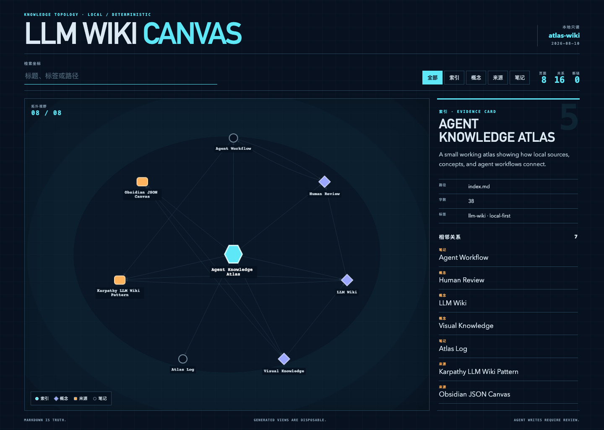
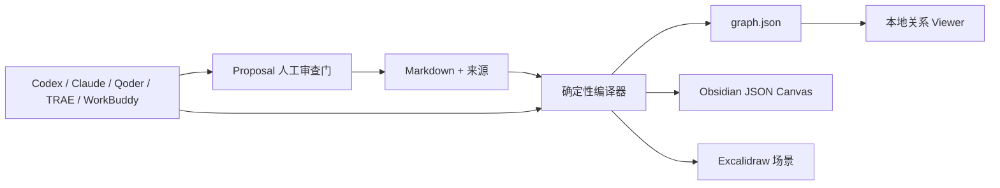

# LLM Wiki Canvas

[English](README.md) · [简体中文](README.zh-CN.md)

[](https://github.com/chicogong/llm-wiki-canvas/actions/workflows/ci.yml)
[](LICENSE)

**面向 Agent 管理的 Markdown 知识库的本地优先可视化编译器。**

LLM Wiki Canvas 把 Markdown、YAML frontmatter 和 WikiLink 编译成确定性的关系图，以及可继续编辑的 Obsidian Canvas 和 Excalidraw 文件。Codex、Claude Code、Qoder、TRAE 和腾讯 WorkBuddy 仍然操作普通文件；人可以查看全局关系、定位知识库问题并审查生成产物。

项目不内置 LLM、向量数据库、聊天界面、云服务或 MCP Server。



## 你能得到什么

- **Markdown 始终是事实源。** 不引入专有数据库，也不强制迁移已有 Vault。
- **关系可以直接看见。** 搜索、筛选页面，并查看一个页面周围的证据与相邻关系。
- **知识库质量可以测试。** 断链、歧义链接、缺少标题和孤立页面都有准确路径。
- **Canvas 的所有权仍属于你。** 重建时保留节点位置、文字/链接/分组批注和手工连线，只安置新增页面。
- **Excalidraw 仍是开放交接文件。** 重建时保留页面位置、手绘批注和嵌入文件，同时刷新分类关系。
- **把大图变成小型解释图。** 选择一个页面及一至两层关系，把同一份证据导出到 Mermaid 或 Excalidraw。
- **Agent 遵循同一套仓库契约。** 内置 Skill 指导 Agent 以文件为中心、经人工审查地工作，不依赖 MCP。
- **Proposal 生命周期可以直接检查。** Changes 展示状态、文件动作、完整哈希、精确 diff 和安全 CLI 下一步，但 UI 本身不执行 apply。
- **审核前即可看到关系影响。** Change blueprint 会标出受影响页面、新增或删除的链接，以及目标哈希冲突，且不会写入正式知识。
- **生成视图可复现。** 稳定的节点和边 ID，让图谱 fixture 与 Git diff 有实际意义。

## 运行真实示例

仓库自带 **Agent Knowledge Atlas**：一个规模不大、可以逐页检查的知识库，内容涉及 LLM Wiki、可视化知识、来源追溯和人工审查。

```bash
git clone https://github.com/chicogong/llm-wiki-canvas.git
cd llm-wiki-canvas
pnpm install
pnpm report:demo
pnpm demo:build
pnpm dev
```

浏览器打开 <http://127.0.0.1:4173>。

示例构建结果可以直接验证：

```text
Built 8 files · 16 links · 0 broken
Graph → public/graph.json
Canvas → examples/atlas-wiki/Atlas.canvas
```

示例的输入和输出：

```text
examples/atlas-wiki/
├── index.md                 # 知识库入口
├── concepts/                # 结构化概念页面
├── sources/                 # 可检查的来源笔记
├── Agent Workflow.md        # Agent 工作方式
├── log.md                   # 维护记录
├── Atlas.canvas             # 可编辑的生成 Canvas
└── Atlas.excalidraw         # 可编辑的 Excalidraw 场景

public/graph.json            # 确定性的 Viewer 输入
```

更完整的操作步骤见 [Examples](examples/README.md)。

Workbench、单命令本地服务、proposal 审查、关系变更叠层，以及可选 Excalidraw/Mermaid 视图的规划见[双语产品路线图](ROADMAP.md)。

## 与其他工具怎么选

LLM Wiki Canvas 有意只做很小的一层：编译并检查已经存在的 Markdown Wiki；它不负责导入所有文档格式，不用 LLM 自动生成整个 Wiki，也不提供 RAG 问答。

| 工具 | 核心职责 | 适合选择它的情况 | 与 LLM Wiki Canvas 的关系 |
| --- | --- | --- | --- |
| **LLM Wiki Canvas** | 确定性关系图、结构检查、可编辑 Canvas | 已经有 Markdown，希望 Agent 共享可测试的视觉契约 | 本项目 |
| **Obsidian** | 人工编辑 Markdown 与个人知识管理 | 需要优秀的日常写作和浏览体验 | 组合使用：Obsidian 编辑 Vault，`lwc` 生成 Canvas |
| **QMD** | 本地 BM25、向量与重排检索 | Agent 需要高质量本地搜索 | 组合使用：QMD 检索，`lwc` 可视化并检查结构 |
| **LLM Wiki** | LLM 自动摄取并维护桌面 Wiki | 希望把文档自动综合成 Wiki 页面 | 自动生成和聊天选它；需要 JSON Canvas 时可再用 `lwc` 处理 Markdown |
| **WeKnora** | 完整 RAG、Agent、Wiki、文档解析和团队平台 | 需要多格式、检索基础设施、集成或 RBAC | 需要平台时选它；它与本项目不是同一轻量层 |

完整能力矩阵、选择建议和组合方式见[对比与决策指南](docs/comparison.zh-CN.md)。能力快照于 2026-08-10 根据各项目官方资料核对。

## 收益对比

这里不编造“提升百分比”或“节省多少小时”。下表只比较能在示例中真实验证的操作差异。

| 任务 | 只有 Markdown 文件 | 使用 LLM Wiki Canvas |
| --- | --- | --- |
| 理解陌生知识库 | 逐页打开并沿链接跳转 | 先看完整关系图，再检查节点及其邻居 |
| 发现结构问题 | 人工检查链接和文件名 | 执行 `lwc lint`，每条诊断都有错误码和源文件路径 |
| 制作 Obsidian Canvas | 手工创建、连接和维护节点 | 从 Wiki 生成，并保留后续手工调整的位置 |
| 让 Agent 参与维护 | 开放较大修改范围，再分散审查 | 先隔离草稿，审查绑定哈希的 proposal，再明确 apply |
| 审查生成变化 | 比较不稳定或不透明的输出 | 对稳定节点、关系 ID 生成的 JSON 做 Git diff |
| 随时退出工具 | 从数据库导出或迁移 | 原始 Markdown 不受影响，生成视图可随时删除重建 |

对仓库自带示例而言，一次确定性构建会把 **8 个源页面、16 条有效关系**同时生成可搜索图谱和可编辑 Canvas，并确认 **0 条断链**。这些数字来自编译器实际输出，不是估算基准。

执行 `pnpm report:demo` 可以复现完整结构快照，包括页面连接情况、来源元数据、诊断、页面类型和高连接页面。个人 Vault、Agent 和 CI 的具体收益与使用流程见[收益与使用场景](docs/value-and-workflows.zh-CN.md)。

## 用在自己的 Vault

开发环境可以直接执行：

```bash
pnpm build
pnpm lwc serve /path/to/vault
pnpm lwc report /path/to/vault
pnpm lwc build /path/to/vault \
  --graph public/graph.json \
  --canvas /path/to/vault/Wiki.canvas \
  --excalidraw /path/to/vault/Wiki.excalidraw
```

执行 `pnpm build` 后，包会暴露 `llm-wiki-canvas` 和 `lwc` 两个命令：

```bash
lwc serve /path/to/vault
lwc scan /path/to/vault -o .lwc/graph.json
lwc lint /path/to/vault
lwc report /path/to/vault
lwc canvas /path/to/vault -o /path/to/vault/Wiki.canvas
lwc excalidraw /path/to/vault -o /path/to/vault/Wiki.excalidraw
lwc diagram /path/to/vault --focus "Human Review" --depth 1 --format mermaid -o Human-Review.mmd
lwc build /path/to/vault \
  --graph .lwc/graph.json \
  --canvas /path/to/vault/Wiki.canvas \
  --excalidraw /path/to/vault/Wiki.excalidraw
```

`lwc serve` 会在 <http://127.0.0.1:4173> 打开包含 Map、Health 和 Changes 的完整 Workbench，并在 Markdown 或 proposal 变化后刷新。默认只监听本机回环地址；重建失败时保留上一份有效图，也不会向 Vault 写入临时生成状态。可用 `--port <端口>` 修改端口，或用 `--no-watch` 查看固定快照。

如果要把生成结果提交到 Git，请给 `lwc build` 传入 `--generated-at <ISO 时间>`，固定该次输出中的生成时间和节点修改时间。

Obsidian、QMD、Agent Skill 和 CI 的具体用法见[使用指南](docs/usage.zh-CN.md)。

## 与 AI 编码 Agent 配合

仓库现在提供一份共享 Agent 契约，并在各工具要求的位置提供原生入口：

| Agent | 已经可以使用的仓库文件 |
| --- | --- |
| Codex | `AGENTS.md` + `.agents/skills/llm-wiki-canvas/` |
| TRAE | `AGENTS.md` + 同一个 `.agents/skills/` Skill |
| Qoder | `AGENTS.md` + `.qoder/skills/llm-wiki-canvas/` 适配入口 |
| Claude Code | `CLAUDE.md` + `.claude/skills/llm-wiki-canvas/` 适配入口 |
| 腾讯 WorkBuddy | 选择仓库为工作区，并用 `@` 引用 `AGENTS.md` 和共享 Skill |

准确设置、兼容边界、权限建议和可直接复制的任务见[与 AI Agent 配合](docs/ai-agents.zh-CN.md)。本地文件权限加 `lwc` 已经足够，这条工作流不需要 MCP Server。

## 审查 Agent 的知识修改

正式 Markdown 修改现在可以一直留在 Vault 外，直到人接受准确内容：

```bash
lwc proposal create /path/to/vault --from /path/to/draft --summary "Add reviewed notes"
lwc proposal show /path/to/proposal.json
lwc proposal review /path/to/proposal.json --approve <proposal-id> --reviewer "Alice"
lwc proposal apply /path/to/proposal.json /path/to/vault --confirm <proposal-id>
```

写入前会检查审批内容、review 记录、目标路径和原文件 SHA-256。源文件被并发修改，或者 proposal 在审批后发生变化，apply 都会失败。拒绝流程、安全边界和可运行示例见[审查式知识修改](docs/proposals.zh-CN.md)。

## 支持的知识库约定

- Markdown 文件和标题
- YAML frontmatter：`title`、`type`/`kind`、`tags`、`summary`、`source`
- WikiLink：普通链接、别名、标题锚点、相对路径和嵌入
- 指向 `.md` 文件的 Markdown 链接
- 页面类型：`index`、`concept`、`source`、`note`
- Obsidian 兼容 JSON Canvas
- `AGENTS.md`、`CLAUDE.md`、`.agents/`、`.claude/`、`.qoder/` 等仓库规则不会混入知识图谱

## 架构



Markdown 是长期保存的知识；关系图、Canvas 和 Viewer 数据都是可以随时重建的投影。

## 当前能力

- 解析 Markdown、YAML frontmatter、WikiLink、嵌入与 `.md` 链接。
- 生成稳定的节点和关系 ID。
- 报告断链、歧义链接、缺少标题和孤立页面。
- 基于实际结构生成 Markdown 或 JSON 健康报告，不虚构综合评分。
- 在应用 Agent 修改前完成 Markdown 草稿隔离、diff、review、reject 和哈希校验。
- 生成 Obsidian 兼容 `.canvas` 文件。
- 生成带稳定 ID 和分类关系样式的可编辑 `.excalidraw` 场景。
- 按方向和页面类型筛选，将一至两层局部关系导出为 Mermaid 或 Excalidraw。
- 重新生成时保留 Canvas 手工位置。
- 在本地 Viewer 中浏览、搜索、筛选并检查关系。
- 通过内置 `llm-wiki-canvas` Skill 指导仓库级 Agent。

## 完整验证

执行发布级验证：

```bash
pnpm verify
```

它包括敏感信息扫描、依赖审计、单元测试、可复现示例构建、TypeScript 与生产构建、Skill 校验、真实 npm 打包安装冒烟测试，以及桌面端和移动端的生产 Viewer 测试。

## 后续方向

Canvas 与 Excalidraw 的位置所有权已经交付。下一项是受控文本导入：把明确选择的本地 Markdown/文本变成带来源证据的草稿，并继续强制经过现有的人工审查 proposal 生命周期。

另见 [贡献指南](CONTRIBUTING.md)、[安全策略](SECURITY.md)和[变更记录](CHANGELOG.md)。

Apache-2.0
