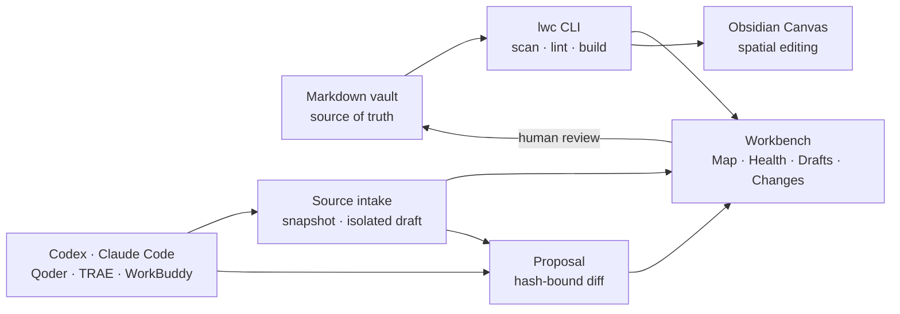

# Product roadmap / 产品路线图

LLM Wiki Canvas is a **local knowledge workbench for people and coding Agents**, not a smaller RAG platform. Markdown remains truth; the CLI compiles observable structure; the Viewer helps people understand health, relationships, and proposed changes; Obsidian remains an excellent editor.

LLM Wiki Canvas 是一个**给人和编程 Agent 共用的本地知识工作台**，不是缩小版 RAG 平台。Markdown 始终是事实源；CLI 编译可验证的结构；Viewer 用于理解健康度、关系与待审变更；Obsidian 继续承担日常编辑。

## Product shape / 产品形态

The product has three surfaces:

1. **CLI** — deterministic automation for Agents and CI.
2. **Workbench** — a calm, read-first review surface for people.
3. **Open files** — Markdown and JSON Canvas that remain useful without this app.

产品只有三层：面向 Agent/CI 的确定性 CLI、面向人的只读优先工作台，以及脱离本项目仍能使用的 Markdown/JSON Canvas 开放文件。

## North star / 北极星

**Turn an existing Markdown Vault into an inspectable Agent knowledge workspace in under two minutes, without migration or a cloud account.**

**两分钟内把已有 Markdown Vault 变成可检查的 Agent 知识工作台，不迁移数据，不注册云账号。**

The daily loop is deliberately small:

1. Open a Vault and compile its current structure.
2. Understand relationships and structural health.
3. Let any coding Agent prepare a file-based proposal.
4. Review exact text, relationship impact, provenance, and target hashes.
5. Apply or reject through an explicit human-controlled command.
6. Keep explaining the result in Obsidian Canvas, Excalidraw, or Mermaid.

日常闭环只有六步：打开并编译、理解关系、Agent 生成提案、人工检查证据、明确应用或拒绝、继续用开放图形格式解释结果。

## Product principles / 产品原则

| Principle | Product consequence |
| --- | --- |
| **Files are the product** | Markdown, source notes, proposals, and review records remain readable without LLM Wiki Canvas. |
| **Agents propose; people decide** | No UI or Skill silently writes formal knowledge. |
| **Structure before retrieval** | Make relationships, provenance, and drift observable before adding search infrastructure. |
| **One core, many Agents** | Codex, Claude Code, Qoder, TRAE, and WorkBuddy use the same CLI and repository contract. |
| **Generated views are replaceable** | Graphs, indexes, Canvas, Excalidraw, and Mermaid outputs can always be rebuilt. |

对应的产品判断是：文件本身可用、Agent 只提案、人负责决定、先解决结构可信度、所有 Agent 共用一个内核、所有生成视图都可以重建。

## Delivery order / 迭代顺序

| Phase | Outcome | Acceptance criteria | Status |
| --- | --- | --- | --- |
| **0.1 Foundation** | Compile Markdown into a graph and Obsidian Canvas; lint structure; create hash-bound proposals | Reproducible graph IDs; preserved Canvas positions; proposal cannot apply before explicit review | Shipped |
| **0.2 Workbench** | Daily-use Map and Health views | Search/filter/inspect relationships; factual diagnostics and hub metrics; desktop/mobile E2E; no hidden AI score | Shipped in current iteration |
| **0.2.1 Local serve** | `lwc serve <vault>` provides one-command local viewing | Loopback-only by default; watches Markdown; rebuilds atomically; clear port/error output; no cloud account | Shipped in current iteration |
| **0.2.2 Changes inbox** | Review Agent proposals inside the Workbench | List proposal status; show file diff and evidence; CLI remains the only apply path initially; no invented reviewer identity | Shipped in current iteration |
| **0.2.3 Proposal topology** | See the structural effect before accepting a proposal | Added edges green, changed pages amber, conflicts red; base/proposal hashes visible; empty and conflict states tested | Shipped in current iteration |
| **0.3 Spatial views** | Generate useful diagrams without locking users in | JSON Canvas remains canonical output; optional Excalidraw export uses its open file format; Mermaid/Markmap are derived views; rebuild never overwrites hand-edited positions silently | Shipped — 0.3.1–0.3.3 |
| **0.4 Source intake** | Turn selected local material into reviewable wiki drafts | Start with Markdown/text; preserve source path/hash; generated pages stay in `.lwc/drafts`; human-approved proposal required | Shipped — 0.4.1–0.4.3 |
| **0.5 Agent compatibility** | Verify that multiple coding Agents share one knowledge contract | Deterministic repository checks; public matrix; static contract evidence separated from real host execution | In progress — 0.5.1 shipped |

## Execution plan / 执行计划

### Completed — 0.3 Spatial explanation / 已完成：空间化解释

The next release should make the product useful for explaining a knowledge system, not merely inspecting it.

| Increment | User outcome | In scope | Acceptance gate | Status |
| --- | --- | --- | --- | --- |
| **0.3.1 Excalidraw export** | Open a generated relationship view in Excalidraw and continue drawing | `lwc build --excalidraw`; page nodes, typed edges, titles, source paths, deterministic IDs | Valid `.excalidraw` file; repeat build is deterministic; exported content contains no absolute path | **Shipped** |
| **0.3.2 Focused diagrams** | Turn a selected page and its neighborhood into a small explainable diagram | Depth 1–2 selection; direction and page-kind filters; Mermaid and Excalidraw output | Same selection produces equivalent nodes/edges in both formats; empty and broken-link states tested | **Shipped** |
| **0.3.3 Position ownership** | Rebuild without destroying a person's layout work | Preserve known coordinates and manual annotations; place only new nodes; report removed generated pages | Existing coordinates survive where the schema permits; regression fixtures cover add/remove/rebuild in Canvas and Excalidraw | **Shipped** |

This phase does **not** add collaborative whiteboards, an Excalidraw editor clone, or AI-generated decorative diagrams.

这一阶段不做多人白板、不复制 Excalidraw 编辑器，也不生成缺乏证据的装饰性图片。

### Completed — 0.4 Governed source intake / 已完成：受控资料进入知识库

| Increment | User outcome | In scope | Acceptance gate | Status |
| --- | --- | --- | --- | --- |
| **0.4.1 Text intake** | Give an Agent a selected Markdown or text file and receive a reviewable draft | Explicit input allowlist; copied source snapshot; source path, SHA-256, imported time, generator; one declared `.lwc/drafts` target | Source file remains untouched; source/snapshot drift and duplicate source-target pairs are blocked; formal Markdown stays unchanged | **Shipped** |
| **0.4.2 Draft workspace** | Inspect generated pages before they become a formal proposal | Draft list, source/draft comparison, provenance ledger, validation errors, exact target paths | Drafts never appear as formal Map nodes; invalid targets cannot become proposals; desktop/mobile read-only E2E | **Shipped** |
| **0.4.3 Intake-to-proposal** | Convert an inspected draft into the existing review lifecycle | Create proposal from selected draft; carry provenance; show text and topology delta in Changes | Zero Vault change before review; hash drift blocks apply; audit record survives rejection | **Shipped** |

PDF, OCR, web crawling, office documents, and bulk folder ingestion stay out until the Markdown/text loop proves useful.

PDF、OCR、网页抓取、Office 文档和整目录批量导入暂不进入这一阶段。

### Now — 0.5 Agent compatibility / 当前：Agent 兼容层

No MCP server is required. The canonical integration is a portable Skill plus the `lwc` CLI.

| Increment | User outcome | In scope | Acceptance gate | Status |
| --- | --- | --- | --- | --- |
| **0.5.1 Contract checker** | Know whether each Agent sees the same rules and Skill | `lwc agents`; Markdown/JSON output; strict CI mode; regular-file checks; generated public matrix | Same files produce deterministic status; absolute workspace paths never leak; WorkBuddy manual setup is not mislabeled native | **Shipped** |
| **0.5.2 Host execution fixtures** | Compare real host output on one public task | Opt-in runners for locally installed host CLIs; shared prompt and expected proposal semantics | Runtime evidence is labeled separately; no credentials or sessions enter fixtures | Planned |
| **0.5.3 Safe scaffolding** | Add missing integration entry points without overwriting repository rules | Dry-run-first initializer; host selection; conflict report | Existing files are never silently replaced; generated adapters point to one canonical Skill | Planned |

The current generated result is [Agent compatibility](docs/agent-compatibility.md); the Chinese interpretation is [Agent 兼容性验证](docs/agent-compatibility.zh-CN.md).

| Host | Integration | Minimum verification |
| --- | --- | --- |
| **Codex** | Repository Skill + `AGENTS.md` | Inspect, lint, create proposal, and show evidence without applying |
| **Claude Code** | Same Skill contract + `CLAUDE.md` example | Equivalent proposal and source citations from the same fixture |
| **Qoder / TRAE** | Markdown instruction template + shell commands | No proprietary adapter required for the core loop |
| **WorkBuddy** | Skill/instruction template with explicit workspace root | Same allowlist, draft boundary, and confirmation behavior |

Acceptance requires a public compatibility matrix with reproducible commands. A host is not marked supported merely because it can read Markdown.

验收必须提供可复现的兼容矩阵；“能读取 Markdown”不等于已经兼容完整提案闭环。

### Release — 0.6 Open-source readiness / 发布：开源可用性

- One command starts the example and one command verifies the repository.
- npm package smoke tests run on supported Node versions and macOS/Linux CI.
- English and Chinese quick starts describe the same product boundary.
- Example data is synthetic, useful, and covered by secret scanning.
- Contribution templates route feature requests into Map, Health, Changes, Canvas, or Intake.
- A changelog documents graph, proposal, Canvas, and export schema compatibility.

## Release gates / 发布门槛

Every milestone must preserve these invariants:

| Gate | Required evidence |
| --- | --- |
| **Local-first** | Default network access is zero; local server binds loopback only. |
| **Safe writes** | Formal Markdown is unchanged before explicit review and confirmation. |
| **Determinism** | Same inputs and fixed timestamps produce identical generated artifacts. |
| **Provenance** | Material generated content points to source path/hash and lifecycle state. |
| **Portability** | Generated files use open formats and contain no machine-specific absolute paths. |
| **Quality** | Core tests, package smoke, secret/dependency audits, and desktop/mobile E2E pass. |

## Success measures / 成功指标

These are verifiable product measures, not invented productivity percentages:

- **Time to first map:** a new contributor can open the example Workbench in under two minutes after dependencies are installed.
- **Review coverage:** every Agent-authored formal change has a proposal ID, exact diff, target hash, and lifecycle state.
- **Write safety:** automated tests demonstrate zero formal-file mutation before review and rejection.
- **Rebuild trust:** tracked fixtures remain deterministic and hand-edited spatial positions survive rebuilds.
- **Host parity:** supported Agent hosts produce the same proposal semantics from the same public fixture.

这些指标只衡量可复现事实，不宣称未经真实用户研究验证的“节省百分比”。

## Prioritization rule / 排序规则

When choosing between two features, prefer the one that improves the closed loop:

`understand → propose → inspect evidence → decide → rebuild`

Features that mainly increase ingestion breadth, chat capability, or infrastructure complexity wait until they improve this loop with measurable evidence.

## Interface contract / 界面约定

- **Map** answers: “What is connected, and why?” It shows page type, direction, edge kind, path, tags, and source summary.
- **Health** answers: “Can I trust the current structure?” It only reports compiler facts: links, orphans, diagnostics, and connectivity.
- **Drafts** answers: “What source did the Agent receive, and is its isolated output safe to propose?” It exposes provenance, hash state, scope, and blockers without writing.
- **Changes** answers: “What does the Agent want to change?” It separates summary, exact diff, topology impact, and the human decision.
- **Canvas** answers: “How do I arrange and explain this spatially?” It stays editable in Obsidian and later Excalidraw.

- **Map** 回答“哪些知识有关，为什么有关”；展示页面类型、方向、关系类型、路径、标签和摘要。
- **Health** 回答“当前结构是否可信”；只展示编译器事实，不生成神秘评分。
- **Drafts** 回答“Agent 收到了什么来源，隔离草稿是否可以安全进入 Proposal”；展示溯源、哈希状态、范围和阻塞原因，但不写入。
- **Changes** 回答“Agent 想改什么”；明确分开摘要、原始 diff、关系影响和人工决策。
- **Canvas** 回答“如何用空间结构解释”；继续允许在 Obsidian、后续 Excalidraw 中手工编辑。

## Deliberate non-goals / 暂不做

- No embedded model, chat shell, vector database, MCP requirement, account system, or cloud sync.
- No silent Agent writes and no generated confidence score presented as fact.
- No attempt to replace Obsidian, QMD, WeKnora, or LLM Wiki; integrate through files and small adapters where the boundary is useful.

- 不内置模型、聊天壳、向量库、MCP 前置要求、账号系统或云同步。
- 不允许 Agent 静默写入，也不把生成的“置信分”伪装成事实。
- 不试图替代 Obsidian、QMD、WeKnora 或 LLM Wiki；只在边界清楚时通过文件和轻量适配组合。
