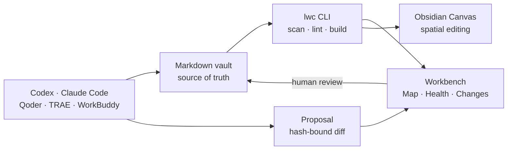

# Product roadmap / 产品路线图

LLM Wiki Canvas is a **local knowledge workbench for people and coding Agents**, not a smaller RAG platform. Markdown remains truth; the CLI compiles observable structure; the Viewer helps people understand health, relationships, and proposed changes; Obsidian remains an excellent editor.

LLM Wiki Canvas 是一个**给人和编程 Agent 共用的本地知识工作台**，不是缩小版 RAG 平台。Markdown 始终是事实源；CLI 编译可验证的结构；Viewer 用于理解健康度、关系与待审变更；Obsidian 继续承担日常编辑。

## Product shape / 产品形态

The product has three surfaces:

1. **CLI** — deterministic automation for Agents and CI.
2. **Workbench** — a calm, read-first review surface for people.
3. **Open files** — Markdown and JSON Canvas that remain useful without this app.

产品只有三层：面向 Agent/CI 的确定性 CLI、面向人的只读优先工作台，以及脱离本项目仍能使用的 Markdown/JSON Canvas 开放文件。

## Delivery order / 迭代顺序

| Phase | Outcome | Acceptance criteria | Status |
| --- | --- | --- | --- |
| **0.1 Foundation** | Compile Markdown into a graph and Obsidian Canvas; lint structure; create hash-bound proposals | Reproducible graph IDs; preserved Canvas positions; proposal cannot apply before explicit review | Shipped |
| **0.2 Workbench** | Daily-use Map and Health views | Search/filter/inspect relationships; factual diagnostics and hub metrics; desktop/mobile E2E; no hidden AI score | Shipped in current iteration |
| **0.2.1 Local serve** | `lwc serve <vault>` provides one-command local viewing | Loopback-only by default; watches Markdown; rebuilds atomically; clear port/error output; no cloud account | Shipped in current iteration |
| **0.2.2 Changes inbox** | Review Agent proposals inside the Workbench | List proposal status; show file diff and evidence; CLI remains the only apply path initially; no invented reviewer identity | Shipped in current iteration |
| **0.2.3 Proposal topology** | See the structural effect before accepting a proposal | Added edges green, changed pages amber, conflicts red; base/proposal hashes visible; empty and conflict states tested | Shipped in current iteration |
| **0.3 Spatial views** | Generate useful diagrams without locking users in | JSON Canvas remains canonical output; optional Excalidraw export uses its open file format; Mermaid/Markmap are derived views; rebuild never overwrites hand-edited positions silently | Planned |
| **0.4 Source intake** | Turn selected local material into reviewable wiki drafts | Start with Markdown/text; preserve source path/hash; generated pages stay in `.lwc/drafts`; human-approved proposal required | Planned |

## Interface contract / 界面约定

- **Map** answers: “What is connected, and why?” It shows page type, direction, edge kind, path, tags, and source summary.
- **Health** answers: “Can I trust the current structure?” It only reports compiler facts: links, orphans, diagnostics, and connectivity.
- **Changes** will answer: “What does the Agent want to change?” It separates summary, exact diff, topology impact, and the human decision.
- **Canvas** answers: “How do I arrange and explain this spatially?” It stays editable in Obsidian and later Excalidraw.

- **Map** 回答“哪些知识有关，为什么有关”；展示页面类型、方向、关系类型、路径、标签和摘要。
- **Health** 回答“当前结构是否可信”；只展示编译器事实，不生成神秘评分。
- **Changes** 将回答“Agent 想改什么”；明确分开摘要、原始 diff、关系影响和人工决策。
- **Canvas** 回答“如何用空间结构解释”；继续允许在 Obsidian、后续 Excalidraw 中手工编辑。

## Deliberate non-goals / 暂不做

- No embedded model, chat shell, vector database, MCP requirement, account system, or cloud sync.
- No silent Agent writes and no generated confidence score presented as fact.
- No attempt to replace Obsidian, QMD, WeKnora, or LLM Wiki; integrate through files and small adapters where the boundary is useful.

- 不内置模型、聊天壳、向量库、MCP 前置要求、账号系统或云同步。
- 不允许 Agent 静默写入，也不把生成的“置信分”伪装成事实。
- 不试图替代 Obsidian、QMD、WeKnora 或 LLM Wiki；只在边界清楚时通过文件和轻量适配组合。
