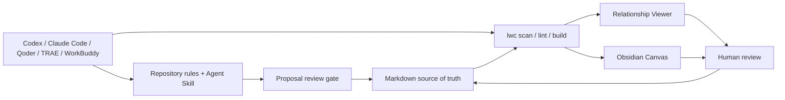

# Using AI agents

[English](ai-agents.md) · [简体中文](ai-agents.zh-CN.md)

LLM Wiki Canvas is not another chat shell. It gives Codex, Claude Code, Qoder, TRAE, and Tencent WorkBuddy one local knowledge contract: agents edit Markdown and run `lwc`; people review the result through Git diffs, the relationship Viewer, and Obsidian Canvas.



Local files and the CLI are already the common interface for these agents, so this workflow does not need MCP. MCP or a dedicated connector becomes useful only when a later workflow reaches remote search, tickets, cloud drives, or enterprise authorization.

## Current compatibility

| Tool | Repository guidance | Project Skill | Repository status | How to use it |
| --- | --- | --- | --- | --- |
| **Codex** | `AGENTS.md` | `.agents/skills/<name>/SKILL.md` | Native | Open the repository and ask it to use the `llm-wiki-canvas` Skill |
| **TRAE** | `AGENTS.md` / Rules | `.agents/skills/<name>/SKILL.md` | Native | Open the repository in IDE or SOLO and describe the wiki task |
| **Qoder** | Automatically recognizes `AGENTS.md` | `.qoder/skills/<name>/SKILL.md` | Thin adapter included | Restart Qoder, then rely on automatic activation or select the Skill from `/` |
| **Claude Code** | `CLAUDE.md` imports `AGENTS.md` | `.claude/skills/<name>/SKILL.md` | Thin adapter included | Run `claude` in the repository; rely on automatic activation or run `/llm-wiki-canvas` |
| **Tencent WorkBuddy** | Reference `@AGENTS.md` in the task | Native custom Skills use `skill.yml`, not the same directory protocol | Workspace integration | Select the repository or Vault as the working directory and `@`-reference the rules and canonical Skill |

“Native” means the tool discovers the repository files through its documented mechanism; it does not bypass permission prompts. The Qoder and Claude Code adapters only redirect their native Skill entry points to the canonical implementation in `.agents/skills/llm-wiki-canvas/`, avoiding three copies of the workflow.

## Recommended workflow

1. **Inspect read-only:** read `AGENTS.md`, the wiki `index.md`, and relevant sources before editing.
2. **Measure and check structure:** run `lwc report <vault>` and `lwc lint <vault>`; use `lwc scan` when the full relationship graph is needed.
3. **Propose changes:** list the pages, WikiLinks, evidence, and unresolved questions that would change.
4. **Review:** inspect the plan or Changes / diff before authorizing writes.
5. **Rebuild and verify:** run `lwc build`; inspect diagnostics and the Markdown, `graph.json`, and `.canvas` diffs.

For a selected Markdown/text source, use `lwc intake create → show → propose` before the shipped `lwc proposal show → review/reject → apply` lifecycle. Intake binds source and snapshot hashes plus one target; Proposal binds the exact draft, review record, and current target state. A person can inspect the same chain in Workbench **Drafts**, then continue into **Changes**; neither view performs a transition. For maintenance without an external source, use `proposal create` directly. See [Governed source intake](intake.md) and [Reviewed knowledge changes](proposals.md).

## Copy-ready tasks

Read-only orientation:

```text
Use the llm-wiki-canvas Skill. Read AGENTS.md and <vault>/index.md first. Analyze only; do not edit files.
Run lwc report <vault> and lwc lint <vault>, then explain the scope, connectivity, source metadata, core pages, direct relationships, broken links, ambiguous links, and orphans. Cite an exact source path for every material claim.
```

Turn one selected source into a reviewable draft:

```text
Use the llm-wiki-canvas Skill to inspect <vault>. Register <source-file> with lwc intake create, declaring exactly one target and recording this Agent as generator. Edit only the printed draft, then show the intake and convert it into an lwc proposal.
Do not review, apply, or edit formal wiki files. Return the intake ID, source SHA-256, proposal ID, exact diff, diagnostics, and unresolved questions, then stop for human review.
```

Generate visual relationships from notes:

```text
Inspect the frontmatter and WikiLinks in <vault>. Preserve the original notes and never overwrite sources with generated prose.
After I approve the repair plan, generate <vault>/Wiki.canvas and the Viewer graph.json. Report source file, resolved relationship, and diagnostic counts.
```

Combine it with QMD retrieval:

```text
Use QMD to retrieve the local pages most relevant to “<question>”, then use lwc to inspect their one-hop WikiLinks and source relationships.
Separate source facts, existing summaries, and your inferences, and cite local paths.
```

## Tool-specific setup

### Codex

Start Codex at the repository root. It reads `AGENTS.md` and discovers the shared Skill from `.agents/skills`. A minimal task is:

```text
Use the llm-wiki-canvas Skill to inspect examples/atlas-wiki and its source chain without editing.
```

Official Codex guidance uses `AGENTS.md` for repository instructions and `.agents/skills` for project Skills. Skills package reusable workflows; MCP is intended for access to external systems. [Codex customization](https://learn.chatgpt.com/docs/customization/overview)

### TRAE

Open the repository in TRAE IDE or SOLO. This repository's `AGENTS.md` and `.agents/skills/llm-wiki-canvas` are ready without copying. TRAE's changelog documents project Skills, `.agents/skills` loading, and nested `AGENTS.md` support. [TRAE changelog](https://www.trae.ai/changelog)

### Qoder

Open the repository in Qoder. Root `AGENTS.md` supplies the shared constraints and `.qoder/skills/llm-wiki-canvas/SKILL.md` is the native Skill entry point. If a newly added top-level Skill is absent, restart Qoder and inspect the `/` menu.

Qoder documents compatibility with root `AGENTS.md` while Qoder Rules win a conflict. Its native project Skill location is `.qoder/skills/{skill-name}/SKILL.md`. [Qoder Rules](https://docs.qoder.com/user-guide/rules) · [Qoder Skills](https://docs.qoder.com/en/cli/Skills)

### Claude Code

Run `claude` at the repository root. `CLAUDE.md` reuses the shared guidance with `@AGENTS.md`, while `.claude/skills/llm-wiki-canvas` provides `/llm-wiki-canvas`.

Claude Code documents `@path` imports from `CLAUDE.md` and project Skill discovery at `.claude/skills/<name>/SKILL.md`. [Claude Code memory](https://docs.anthropic.com/en/docs/claude-code/memory) · [Claude Code Skills](https://code.claude.com/docs/en/skills)

### Tencent WorkBuddy and CodeBuddy

Tencent WorkBuddy is a broader workbench. Select the repository or Vault as the task working directory, add `@AGENTS.md` and `@.agents/skills/llm-wiki-canvas/SKILL.md` as context, ask it to run the local `lwc`, keep Default Permissions enabled, and review the Changes view after edits.

```text
Use the current repository as the working directory. Read @AGENTS.md and
@.agents/skills/llm-wiki-canvas/SKILL.md. Run lint on examples/atlas-wiki, but do not edit files.
```

A WorkBuddy custom Skill normally contains `skill.yml`, implementation files, and a README, which is not the Agent Skills `SKILL.md` discovery protocol. The repository therefore does not claim automatic shared-Skill discovery in WorkBuddy. Tencent's related CodeBuddy Code/CLI is more development-oriented and can run the same CLI workflow from the repository, but it should not be conflated with the WorkBuddy workbench. [Create a WorkBuddy task](https://www.workbuddy.ai/docs/workbuddy/Create-Task) · [WorkBuddy permission modes](https://www.workbuddy.ai/docs/workbuddy/From-Beginner-to-Expert-Guide/Function-Description/Permission-Modes) · [WorkBuddy custom Skills](https://www.workbuddy.ai/docs/workbuddy/From-Beginner-to-Expert-Guide/Practice-Cases/Create-Skills)

## Permissions and open-source boundaries

- Use read-only or plan mode for first inspection. Do not enable Full Access or skip permission checks by default.
- An agent may maintain knowledge, but it must not present generated summaries as source facts.
- Before committing, inspect `git status --short`, the complete diff, and the sensitive-information scan.
- Commit sanitized examples, reproducible fixtures, rules, and documentation; do not commit private vaults, API keys, sessions, caches, absolute personal paths, or unreviewed screenshots.
- `graph.json`, Canvas, and the Viewer are projections. Markdown, sources, and human review records remain truth.
