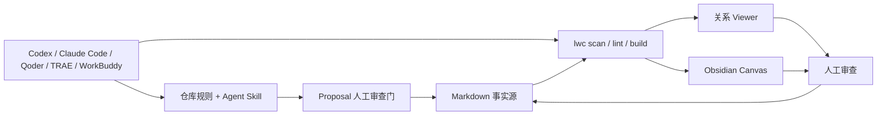

# 与 AI Agent 配合

[English](ai-agents.md) · [简体中文](ai-agents.zh-CN.md)

LLM Wiki Canvas 不是另一个聊天壳。它给 Codex、Claude Code、Qoder、TRAE 和腾讯 WorkBuddy 提供同一套本地知识契约：Agent 读写 Markdown、执行 `lwc`，人通过 Git diff、关系 Viewer 和 Obsidian Canvas 审查结果。



本地文件和 CLI 已经是这些 Agent 的共同接口，因此这一流程不需要 MCP。将来只有接入远程搜索、工单、云盘或企业权限系统时，才值得增加 MCP 或专用连接器。

## 当前兼容矩阵

| 工具 | 仓库规则 | 项目 Skill | 本仓库状态 | 使用方式 |
| --- | --- | --- | --- | --- |
| **Codex** | `AGENTS.md` | `.agents/skills/<name>/SKILL.md` | 原生 | 打开仓库，要求使用 `llm-wiki-canvas` Skill |
| **TRAE** | `AGENTS.md` / Rules | `.agents/skills/<name>/SKILL.md` | 原生 | IDE 或 SOLO 中打开仓库，直接描述知识库任务 |
| **Qoder** | 自动识别 `AGENTS.md` | `.qoder/skills/<name>/SKILL.md` | 薄适配已提交 | 重启 Qoder 后自动触发，或从 `/` 菜单选择 Skill |
| **Claude Code** | `CLAUDE.md`，其中导入 `AGENTS.md` | `.claude/skills/<name>/SKILL.md` | 薄适配已提交 | 在仓库运行 `claude`，自动触发或执行 `/llm-wiki-canvas` |
| **腾讯 WorkBuddy** | 在任务中用 `@AGENTS.md` 引用 | 原生自定义 Skill 使用 `skill.yml`，不是同一目录协议 | 工作区接入 | 选择仓库或 Vault 为工作目录，`@` 引用规则与标准 Skill |

“原生”表示工具会按自己的发现机制加载仓库文件，不表示 Agent 可以绕过权限确认。Qoder 和 Claude Code 的薄适配只负责把各自原生 Skill 入口转到 `.agents/skills/llm-wiki-canvas/` 的唯一规范实现，避免维护三份流程。

## 推荐工作流

1. **只读理解**：读 `AGENTS.md`、Wiki 的 `index.md` 和相关来源，先不修改。
2. **衡量并检查结构**：执行 `lwc report <vault>` 和 `lwc lint <vault>`；需要全局关系时执行 `lwc scan`。
3. **提出修改**：列出准备修改的页面、WikiLink、依据和未解决问题。
4. **人工确认**：检查 Agent 的计划或 Changes / diff，再授权写入。
5. **重建验证**：执行 `lwc build`，检查诊断、Markdown diff、`graph.json` 和 `.canvas` diff。

对于明确选择的 Markdown/文本来源，先执行 `lwc intake create → show → propose`，再进入已经交付的 `lwc proposal show → review/reject → apply` 生命周期。Intake 绑定来源、快照哈希和唯一目标；Proposal 绑定准确草稿、审查记录和当前目标状态。人可以在 Workbench **Drafts** 中检查同一条证据链，再进入 **Changes**；两个页面都不会执行状态转换。没有外部来源的维护任务可以直接使用 `proposal create`。详见[受控资料进入知识库](intake.zh-CN.md)和[审查式知识修改](proposals.zh-CN.md)。

## 可以直接复制的任务

只读熟悉一个知识库：

```text
使用 llm-wiki-canvas Skill。先读 AGENTS.md 和 <vault>/index.md，只读分析，不修改文件。
运行 lwc report <vault> 和 lwc lint <vault>，说明范围、连接情况、来源元数据、核心页面、直接关系、断链、歧义链接和孤立页面；每个结论引用准确源文件路径。
```

把一份明确选择的来源变成可审查草稿：

```text
使用 llm-wiki-canvas Skill 检查 <vault>。通过 lwc intake create 登记 <source-file>，只声明一个目标并记录当前 Agent 为 generator。只编辑命令打印的草稿，然后展示 Intake 并转换为 lwc proposal。
不要 review、apply 或修改正式 Wiki。返回 intake ID、来源 SHA-256、proposal ID、准确 diff、诊断和未解决问题，然后停下来等待人工审查。
```

从笔记生成可视关系图：

```text
检查 <vault> 的 frontmatter 与 WikiLink，保留原始笔记，不要用生成文本覆盖来源。
修复计划经确认后，生成 <vault>/Wiki.canvas 和 Viewer 使用的 graph.json；报告文件数、有效关系数和诊断数。
```

与 QMD 组合检索：

```text
先用 QMD 找到与“<问题>”最相关的本地页面，再用 lwc 检查这些页面的一跳 WikiLink 和来源关系。
答案必须区分原始事实、现有总结和你的推断，并引用本地路径。
```

## 各工具怎么打开

### Codex

从仓库根目录启动 Codex。它会读取 `AGENTS.md`，并从 `.agents/skills` 发现共享 Skill。可以直接说：

```text
使用 llm-wiki-canvas Skill，只读检查 examples/atlas-wiki 的结构与来源链。
```

Codex 官方将 `AGENTS.md` 用作仓库指导，并把 `.agents/skills` 用作项目 Skills；Skills 适合可复用工作流，MCP 更适合外部系统接入。[Codex customization](https://learn.chatgpt.com/docs/customization/overview)

### TRAE

在 TRAE IDE 或 SOLO 中打开仓库。当前仓库的 `AGENTS.md` 和 `.agents/skills/llm-wiki-canvas` 可以直接使用，无需复制。TRAE 的更新记录已经列出项目级 Skills、`.agents/skills` 加载和嵌套 `AGENTS.md` 支持。[TRAE changelog](https://www.trae.ai/changelog)

### Qoder

在 Qoder 中打开仓库。根 `AGENTS.md` 提供共同约束，`.qoder/skills/llm-wiki-canvas/SKILL.md` 是原生入口。新增顶层 Skill 后如果没有出现，重启 Qoder，再在 `/` 菜单检查。

Qoder 官方规则说明它兼容根 `AGENTS.md`，但 Qoder Rules 冲突时优先；项目 Skill 的原生位置是 `.qoder/skills/{skill-name}/SKILL.md`。[Qoder Rules](https://docs.qoder.com/user-guide/rules) · [Qoder Skills](https://docs.qoder.com/en/cli/Skills)

### Claude Code

在仓库根目录执行 `claude`。`CLAUDE.md` 通过 `@AGENTS.md` 复用共同规则，`.claude/skills/llm-wiki-canvas` 提供 `/llm-wiki-canvas`。

Claude Code 官方支持 `CLAUDE.md` 的 `@path` 导入，也会从 `.claude/skills/<name>/SKILL.md` 发现项目 Skill。[Claude Code memory](https://docs.anthropic.com/zh-CN/docs/claude-code/memory) · [Claude Code Skills](https://code.claude.com/docs/en/skills)

### 腾讯 WorkBuddy 与 CodeBuddy

腾讯 WorkBuddy 更偏通用工作台：创建任务时选择仓库或 Vault 为工作目录，然后用 `@AGENTS.md` 和 `@.agents/skills/llm-wiki-canvas/SKILL.md` 补充上下文，再要求它调用本地 `lwc`。日常使用保持“默认权限”，修改后在 Changes 视图审查结果。

```text
工作目录选择当前仓库。请读取 @AGENTS.md 和 @.agents/skills/llm-wiki-canvas/SKILL.md，
只读检查 examples/atlas-wiki，运行 lint，但不要修改文件。
```

WorkBuddy 的自定义 Skill 通常是 `skill.yml + 实现文件 + README`，与 Agent Skills 的 `SKILL.md` 发现协议不同，因此本仓库不宣称它能自动加载共享 Skill。腾讯的 CodeBuddy Code/CLI 是更偏代码开发的相关产品，可以在仓库目录直接执行相同 CLI 工作流，但不要与 WorkBuddy 工作台混为一谈。[创建 WorkBuddy 任务](https://www.workbuddy.ai/docs/workbuddy/Create-Task) · [WorkBuddy 权限模式](https://www.workbuddy.ai/docs/workbuddy/From-Beginner-to-Expert-Guide/Function-Description/Permission-Modes) · [WorkBuddy 自定义 Skills](https://www.workbuddy.ai/docs/workbuddy/From-Beginner-to-Expert-Guide/Practice-Cases/Create-Skills)

## 权限与开源边界

- 第一次分析使用只读或计划模式；日常不要默认开启 Full Access 或跳过权限确认。
- Agent 可以修改知识，但不能把生成摘要伪装成来源事实。
- 提交前检查 `git status --short`、完整 diff 和敏感信息扫描结果。
- 公开仓库只提交脱敏示例、可复现 fixture、规则和文档；不要提交个人 Vault、API Key、会话、缓存、绝对个人路径或未经审查的截图。
- `graph.json`、Canvas 和 Viewer 是投影；Markdown、来源和人工审查记录才是事实源。
