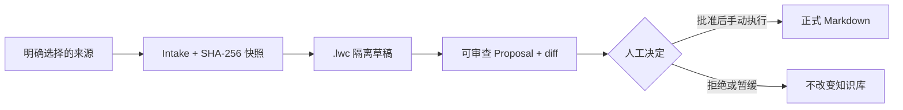

# DeepSeek Harness 知识管理员

[English](deepseek-harness.md) · [简体中文](deepseek-harness.zh-CN.md)

这个集成让 DeepSeek Harness 管理知识库的“收件箱”，而不是直接改知识库。Agent 可以理解现状、读取有限上下文、把一份明确来源加工成隔离草稿并生成 Proposal；只有人可以批准和应用。



## 六个工具

| 工具 | 能做什么 | 不能做什么 |
| --- | --- | --- |
| `lwc_knowledge_status` | 查看结构、来源和诊断 | 修改文件 |
| `lwc_knowledge_context` | 按 0–2 跳、最多 12 页和 4000 词读取上下文 | 附加整个 Vault |
| `lwc_intake_create` | 为一份仓库内 Markdown/文本建立来源快照 | 读取 `.lwc` 或仓库外来源 |
| `lwc_intake_draft` | 只写 Intake 声明的隔离草稿 | 写正式 Markdown、`index.md`、`log.md` |
| `lwc_intake_propose` | 校验来源、草稿和目标并生成 Proposal | 批准或应用 |
| `lwc_proposal_show` | 展示限定路径下的 Proposal 和 diff | 改变 Proposal 状态 |

## 本地试用

正式发布前，从仓库构建两个 tarball，并在一个独立 Harness profile 中安装；不要把实验包混进默认 profile：

```bash
pnpm build
pnpm --dir integrations/deepseek-harness test
npm pack
npm pack --prefix integrations/deepseek-harness
dsh plugin --profile lwc-knowledge add <llm-wiki-canvas.tgz>
dsh plugin --profile lwc-knowledge add <dsh-llm-wiki-canvas.tgz>
dsh --profile lwc-knowledge
```

在目标知识库根目录启动最后一条命令。插件包声明的 profile layer 会禁用通用 shell、PowerShell、文件编辑/搜索、Web、工作流和子 Agent 工具，只保留 LWC 专用写入面。Harness 的用户级 patch 在 bundle 之后应用，因此若用户重新启用这些工具，隔离保证会变弱；发布或排障时必须检查最终 effective config。

## 人工接管

Agent 返回 Proposal 后停止。人先运行：

```bash
lwc proposal show .lwc/proposals/<proposal>.json
```

确认来源 SHA-256、单一目标和 diff 后，才可以单独执行 `proposal review --approve` 与 `proposal apply --confirm`。这些命令永远不在插件工具目录中。

## 回滚

从该 Harness profile 删除 `@chicogong/dsh-llm-wiki-canvas`，或直接弃用独立 profile。插件不会改正式 Markdown；未应用的 `.lwc/drafts` 与 `.lwc/proposals` 是本地工作状态，可在确认不再需要证据后清理。

当前状态：实验集成，面向 DeepSeek Harness `0.1.0-rc.6` 契约。Harness 官方仍标注 Developer Preview；正式 npm 发布和真实模型任务需要各自单独证据与审批。
