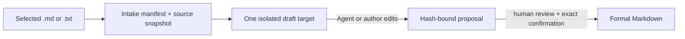

# Governed source intake

[English](intake.md) · [简体中文](intake.zh-CN.md)

Source intake lets a coding Agent turn one explicitly selected Markdown or UTF-8 text file into one isolated wiki draft. LLM Wiki Canvas records and enforces provenance; it does not call an LLM or silently write formal knowledge.

## Lifecycle



Create an intake from the repository example:

```bash
lwc intake create examples/atlas-wiki \
  --source examples/intake-source/meeting.txt \
  --target "concepts/Meeting Decision.md" \
  --generator Codex
```

The command prints three paths under `examples/atlas-wiki/.lwc/drafts/<intake-id>/`:

- `intake.json` records the source path, copied snapshot, SHA-256, byte count, generator, target, and lifecycle state.
- `.source/meeting.txt` is the copied source evidence.
- `concepts/Meeting Decision.md` is the only declared draft target.

Inspect the manifest, then ask the Agent to edit only the printed draft:

```bash
lwc intake show examples/atlas-wiki/.lwc/drafts/<intake-id>/intake.json
```

The generated placeholder deliberately cannot become a proposal. After the draft contains source-grounded knowledge, convert it:

```bash
lwc intake propose \
  examples/atlas-wiki/.lwc/drafts/<intake-id>/intake.json \
  examples/atlas-wiki \
  --summary "Record the meeting decision"
```

Proposal conversion fails if:

- the original source changed, disappeared, or became a symbolic link;
- the copied snapshot no longer matches its SHA-256;
- the placeholder draft was not edited;
- an Agent added undeclared Markdown targets;
- the intake belongs to another Vault or was already proposed.

On success, formal Markdown is still unchanged. The proposal's hash-protected payload retains the Intake ID, source filename and SHA-256, declared target, and generator. Continue through the existing human gate:

```bash
lwc proposal show examples/atlas-wiki/.lwc/proposals/<proposal-id>.json
lwc proposal review examples/atlas-wiki/.lwc/proposals/<proposal-id>.json \
  --approve <proposal-id> --reviewer "Alice"
lwc proposal apply examples/atlas-wiki/.lwc/proposals/<proposal-id>.json \
  examples/atlas-wiki --confirm <proposal-id>
```

## Ownership and privacy

- The original source and formal Vault are never modified during intake creation or proposal conversion.
- `.lwc/` is ignored local working state. Intake manifests contain the local source path so the CLI can revalidate it; do not commit manifests from a private Vault.
- `--generator` records the Agent, model, or author responsible for the draft. It does not invoke that tool.
- One intake has one declared target. Multi-page synthesis remains out of scope until recovery and review semantics are designed.
- PDF, OCR, web crawling, Office documents, bulk folders, vector search, and MCP are not part of this increment.

Run `lwc serve <vault>` and open **Drafts** to inspect the manifest, original and copied-source state, exact hashes, generator, declared scope, source/draft content, and intended target. The view is read-only: it shows a CLI command only when the evidence gate is ready, and proposal review remains in **Changes**.
