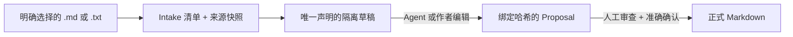

# 受控资料进入知识库

[English](intake.md) · [简体中文](intake.zh-CN.md)

Source Intake 让编程 Agent 把用户明确选择的一份 Markdown 或 UTF-8 文本转换成一份隔离的 Wiki 草稿。LLM Wiki Canvas 负责记录并强制来源边界；它不会自己调用 LLM，也不会静默写入正式知识。

## 生命周期



使用仓库自带的合成示例创建 Intake：

```bash
lwc intake create examples/atlas-wiki \
  --source examples/intake-source/meeting.txt \
  --target "concepts/Meeting Decision.md" \
  --generator Codex
```

命令会在 `examples/atlas-wiki/.lwc/drafts/<intake-id>/` 下打印三个路径：

- `intake.json` 记录来源路径、复制快照、SHA-256、字节数、生成者、目标和生命周期状态。
- `.source/meeting.txt` 是复制的来源证据。
- `concepts/Meeting Decision.md` 是唯一声明的草稿目标。

先查看清单，再让 Agent 只编辑打印出的草稿：

```bash
lwc intake show examples/atlas-wiki/.lwc/drafts/<intake-id>/intake.json
```

自动创建的占位草稿有意不能直接转换为 Proposal。草稿已经包含有来源依据的知识后，再执行：

```bash
lwc intake propose \
  examples/atlas-wiki/.lwc/drafts/<intake-id>/intake.json \
  examples/atlas-wiki \
  --summary "记录会议决策"
```

以下情况会阻止 Proposal 转换：

- 原始来源发生变化、消失或变成符号链接；
- 复制的快照不再匹配 SHA-256；
- 占位草稿没有被编辑；
- Agent 增加了未声明的 Markdown 目标；
- Intake 属于另一个 Vault，或者已经转换过 Proposal。

转换成功后，正式 Markdown 仍然没有变化。Proposal 的哈希保护载荷会保留 Intake ID、来源文件名与 SHA-256、声明目标和生成者。继续经过现有人工门禁：

```bash
lwc proposal show examples/atlas-wiki/.lwc/proposals/<proposal-id>.json
lwc proposal review examples/atlas-wiki/.lwc/proposals/<proposal-id>.json \
  --approve <proposal-id> --reviewer "Alice"
lwc proposal apply examples/atlas-wiki/.lwc/proposals/<proposal-id>.json \
  examples/atlas-wiki --confirm <proposal-id>
```

## 所有权与隐私

- 创建 Intake 和转换 Proposal 都不会修改原始来源或正式 Vault。
- `.lwc/` 是默认忽略的本地工作状态。Intake 清单包含本地来源路径，以便 CLI 重新校验；不要提交私人 Vault 的清单。
- `--generator` 只记录负责草稿的 Agent、模型或作者，不会调用该工具。
- 一份 Intake 只有一个声明目标。在恢复与审查语义设计完成前，不开放多页面批量综合。
- 本阶段不包含 PDF、OCR、网页抓取、Office 文档、批量目录、向量检索和 MCP。

运行 `lwc serve <vault>` 并打开 **Drafts**，即可检查清单、原来源与复制快照状态、准确哈希、生成者、声明范围、来源/草稿内容和预期目标。该页面保持只读：只有证据门通过时才展示 CLI 下一步，Proposal 审查仍在 **Changes** 中完成。
