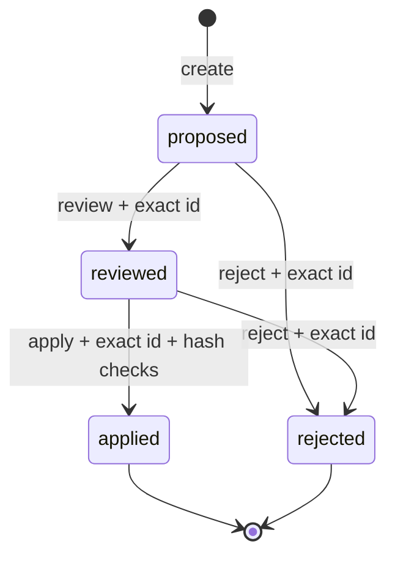

# Reviewed knowledge changes

[English](proposals.md) · [简体中文](proposals.zh-CN.md)

`lwc proposal` separates Agent-generated content from formal Markdown. A draft never writes directly into the wiki. Only a proposal that has been displayed, explicitly reviewed, reconfirmed, and still matches its hashes can be applied.



## Run the repository example

```bash
pnpm proposal:demo
```

It compares `examples/proposal-draft/` with `examples/atlas-wiki/`, writes `.lwc/atlas-demo-proposal.json`, and prints the review diff without changing the Atlas Wiki.

## 1. Let an Agent prepare a draft

The draft mirrors paths inside the wiki but lives outside the formal Vault or under its `.lwc/drafts/` directory:

```text
/path/to/vault/
├── index.md
├── concepts/Existing.md
└── .lwc/drafts/add-source/
    ├── concepts/Existing.md
    └── concepts/New.md
```

The first draft updates a page and the second creates one. Delete proposals are not supported in the current release.

## 2. Create a proposal

```bash
lwc proposal create /path/to/vault \
  --from /path/to/vault/.lwc/drafts/add-source \
  --summary "Add source-backed concept notes"
```

The default output is `/path/to/vault/.lwc/proposals/<proposal-id>.json`. It contains:

- status and creation time;
- target relative paths and create/update operations;
- original and proposed content;
- original-file and proposed-content SHA-256 hashes;
- no absolute Vault path.

Creation does not modify formal Markdown. Unchanged draft files are omitted.

## 3. Display the review material

```bash
lwc proposal show /path/to/proposal.json
```

The output contains status, paths, both hashes, and a Markdown diff. A reviewer must still inspect evidence and sources. Hashes prove that content did not change; they do not prove that it is true.

To inspect every proposal in one read-only queue, run `lwc serve /path/to/vault` and open **Changes**. The Workbench reads the default `.lwc/proposals/` directory, separates open and closed lifecycle states, and shows the same hashes and diff evidence. It displays commands for the next valid transition but never runs review, reject, or apply.

## 4. Review or reject

Copy the complete proposal ID printed by `create`:

```bash
lwc proposal review /path/to/proposal.json \
  --approve proposal-xxxxxxxxxxxx \
  --reviewer "Alice" \
  --note "Sources and links checked"
```

Review changes proposal state only; it still does not modify the wiki. It records the reviewer, time, note, proposal hash, and review hash.

To decline it:

```bash
lwc proposal reject /path/to/proposal.json \
  --confirm proposal-xxxxxxxxxxxx \
  --reason "Source does not support the claim"
```

Both `proposed` and `reviewed` states can be rejected. A `rejected` proposal cannot be applied.

## 5. Apply

```bash
lwc proposal apply /path/to/proposal.json /path/to/vault \
  --confirm proposal-xxxxxxxxxxxx
```

Every condition must pass before a write begins:

- state is `reviewed`;
- confirmation exactly matches the proposal ID;
- neither proposal content nor the review record changed after approval;
- the Vault root name matches;
- every target still has the SHA-256 captured when the proposal was created;
- every target is a non-hidden relative `.md` path inside the Vault;
- no path crosses a symbolic link or targets `AGENTS.md` or `CLAUDE.md`.

Any mismatch fails before writing. After success, state becomes `applied` and the CLI rescans the wiki to report page, relationship, and diagnostic counts.

## 6. Verify the wiki

```bash
lwc report /path/to/vault
lwc lint /path/to/vault
lwc build /path/to/vault \
  --graph public/graph.json \
  --canvas /path/to/vault/Wiki.canvas
git diff -- /path/to/vault
```

## Security boundaries and limits

- Proposal JSON contains full original and proposed text and may contain sensitive knowledge. Keep it in ignored `.lwc/` unless deliberately retaining a sanitized review record.
- The current release supports Markdown create and update only, not delete, rename, or binary attachments.
- Apply validates every target before writing and attempts rollback after ordinary write errors. It is not a database transaction across filesystem failure or forced process termination.
- Review is a local file record, not user authentication or a digital signature. Teams should still use Git review, filesystem permissions, and CI.
- Post-apply structure checks do not replace fact verification, source review, or human responsibility.
