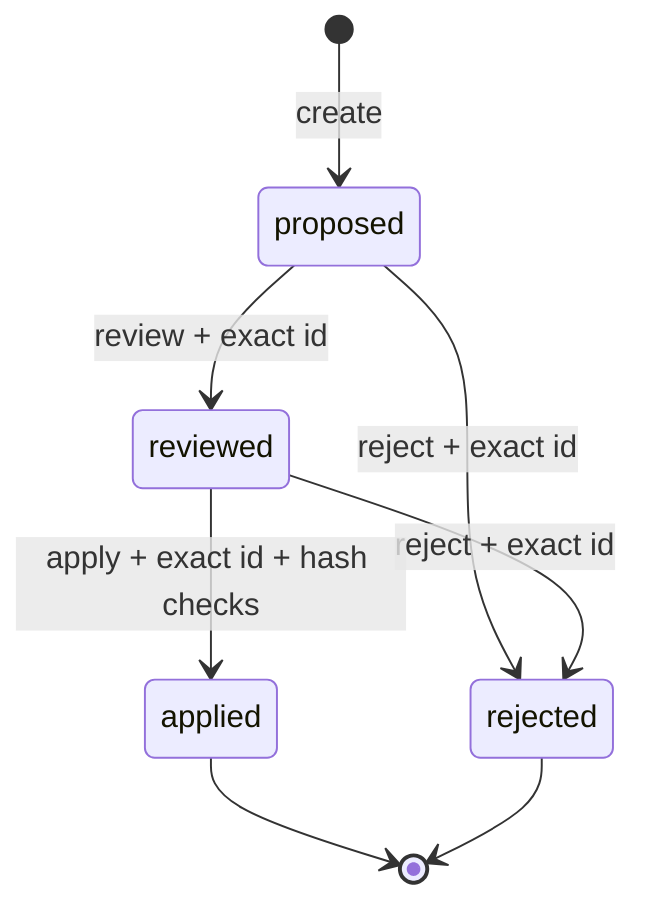

# 审查式知识修改

[English](proposals.md) · [简体中文](proposals.zh-CN.md)

`lwc proposal` 把 Agent 生成内容和正式 Markdown 分开。草稿不会直接写进知识库；只有经过展示、明确 review、再次确认且哈希仍匹配的 proposal 才能 apply。



## 运行仓库示例

```bash
pnpm proposal:demo
```

它把 `examples/proposal-draft/` 与 `examples/atlas-wiki/` 比较，生成 `.lwc/atlas-demo-proposal.json` 并打印审查 diff，但不会修改 Atlas Wiki。

## 1. 让 Agent 准备草稿

草稿目录复用知识库内的相对路径，但放在正式 Vault 外或其 `.lwc/drafts/` 中：

```text
/path/to/vault/
├── index.md
├── concepts/Existing.md
└── .lwc/drafts/add-source/
    ├── concepts/Existing.md
    └── concepts/New.md
```

第一份草稿文件表示更新，第二份表示创建。当前版本不支持删除 proposal。

## 2. 创建 proposal

```bash
lwc proposal create /path/to/vault \
  --from /path/to/vault/.lwc/drafts/add-source \
  --summary "Add source-backed concept notes"
```

默认输出到 `/path/to/vault/.lwc/proposals/<proposal-id>.json`。它包含：

- 状态与创建时间；
- 目标相对路径和 create/update 操作；
- 原内容与建议内容；
- 原文件 SHA-256 和建议内容 SHA-256；
- 不包含绝对 Vault 路径。

创建时不会修改正式 Markdown。没有变化的草稿文件会被忽略。

## 3. 展示审查内容

```bash
lwc proposal show /path/to/proposal.json
```

输出包含状态、路径、两侧哈希和 Markdown diff。审查人还应检查草稿依据与来源；哈希只能证明内容没有变化，不能证明内容真实。

## 4. Review 或 reject

复制 `create` 打印出的完整 proposal ID：

```bash
lwc proposal review /path/to/proposal.json \
  --approve proposal-xxxxxxxxxxxx \
  --reviewer "Alice" \
  --note "Sources and links checked"
```

Review 只更新 proposal 状态，仍然不修改知识库。它记录审查人、时间、说明、proposal 哈希和 review 哈希。

不接受时：

```bash
lwc proposal reject /path/to/proposal.json \
  --confirm proposal-xxxxxxxxxxxx \
  --reason "Source does not support the claim"
```

`proposed` 和 `reviewed` 都可以 reject；`rejected` 不能 apply。

## 5. Apply

```bash
lwc proposal apply /path/to/proposal.json /path/to/vault \
  --confirm proposal-xxxxxxxxxxxx
```

写入前必须同时满足：

- 状态是 `reviewed`；
- 确认文本与 proposal ID 完全一致；
- proposal 内容与 review 记录没有在审批后被修改；
- Vault 根目录名称匹配；
- 所有目标文件仍保持创建 proposal 时的 SHA-256；
- 目标是 Vault 内非隐藏的 `.md` 相对路径；
- 路径不经过符号链接，也不是 `AGENTS.md` 或 `CLAUDE.md`。

任何一项不满足都会在写入前失败。成功后 proposal 进入 `applied`，CLI 会重新扫描并报告页面、关系和诊断数量。

## 6. 验证知识库

```bash
lwc report /path/to/vault
lwc lint /path/to/vault
lwc build /path/to/vault \
  --graph public/graph.json \
  --canvas /path/to/vault/Wiki.canvas
git diff -- /path/to/vault
```

## 安全边界与限制

- proposal JSON 包含完整原文和建议内容，可能含敏感知识；默认保留在被忽略的 `.lwc/`。
- 当前只支持创建和更新 Markdown，不支持删除、重命名或二进制附件。
- apply 在写入前完成全部校验，并在普通写入错误时尝试回滚；它不是跨文件系统故障或进程强制终止下的数据库事务。
- review 是本地文件记录，不提供用户认证或数字签名。团队仍应结合 Git review、文件权限和 CI。
- apply 后结构检查不能替代事实核验、来源审查和人的最终责任。
